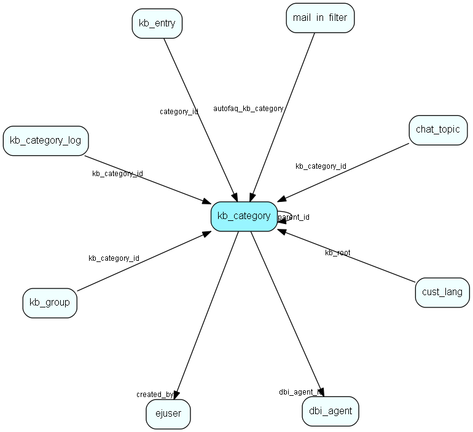

# kb\_category Table (283)

Knowledge base folder hierarchy

## Fields

| Name | Description | Type | Null |
|------|-------------|------|:----:|
|id|The primary key (auto-incremented)|PK| |
|parent\_id|This entry contains a reference to the parent category. NULL or -1 if this is a toplevel category.|FK [kb_category](kb-category.md)| |
|name|The name of this category.|String(64)|&#x25CF;|
|fullname|The full name of this category, i.e. Foo/bar/test.|Clob|&#x25CF;|
|description|The description of this category.|Clob|&#x25CF;|
|sort\_order|A strictly ascending number used for sorting categories when they are listed.|Int| |
|access\_level|The access level for this category (enum).|access_level|&#x25CF;|
|inherited\_access\_level|The lowest access level for this category or any parent|inherited_access_level|&#x25CF;|
|created\_by|The id of the user who created this category.|FK [ejuser](ejuser.md)|&#x25CF;|
|access\_check|Contains a Parser-script used for evaluating customer access to this category.|Clob|&#x25CF;|
|dbi\_agent\_id|Integration agent (eJournal)|FK [dbi_agent](dbi-agent.md)| |
|dbi\_key|The primary key for the integrated entry in the external datasource.|String(255)| |
|dbi\_last\_syncronized|Last external syncronization.|DateTime| |
|dbi\_last\_modified|When the entry was last modified.|DateTime| |

[!include[details](./includes/kb-category.md)]

## Indexes

| Fields | Types | Description |
|--------|-------|-------------|
|id |PK |Clustered, Unique |
|parent\_id |FK |Index |
|sort\_order |Int |Index |
|created\_by |FK |Index |
|dbi\_agent\_id |FK |Index |
|dbi\_key |String(255) |Index |
|dbi\_last\_syncronized |DateTime |Index |
|dbi\_last\_modified |DateTime |Index |

## Relationships

| Table|  Description |
|------|-------------|
|[chat\_topic](chat-topic.md)  |This table contains chat topics. |
|[cust\_lang](cust-lang.md)  |This table contains entries for customer languages. |
|[dbi\_agent](dbi-agent.md)  |DBI agent settings |
|[ejuser](ejuser.md)  |This table contains entries for the users of the system. |
|[kb\_category](kb-category.md)  |Knowledge base folder hierarchy |
|[kb\_category\_log](kb-category-log.md)  |Who and when, if somebody edits a knowledge base folder |
|[kb\_entry](kb-entry.md)  |This table contains FAQ entries. |
|[kb\_group](kb-group.md)  |This table contains FAQ groups. A group is a cluster of entries (potentially located anywhere in the FAQ hierarchy). A group is located in a certain category. |
|[mail\_in\_filter](mail-in-filter.md)  |This table contains entries for the mailboxes the eJournal system is fetching mail from (POP3 or IMAP). |

## Replication Flags

* None

## Security Flags

* No access control via user's Role.

