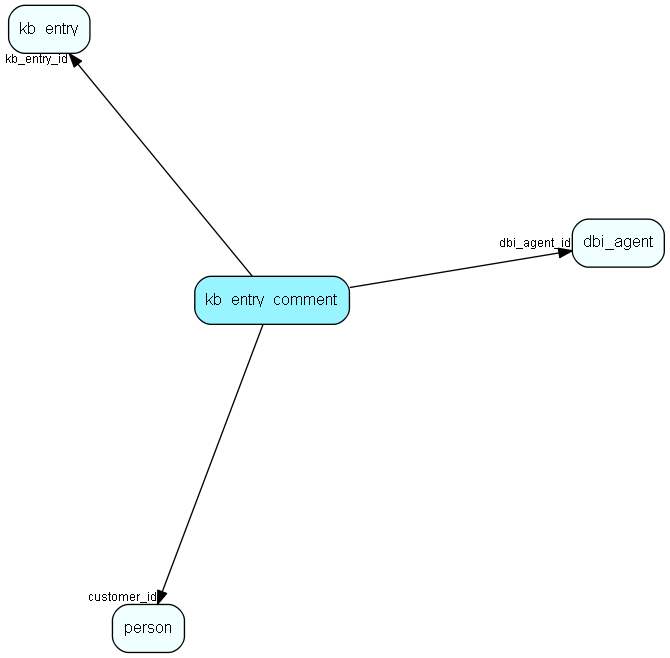

# kb\_entry\_comment Table (289)

Comments to entries in the knowledge base, typically made by customers

## Fields

| Name | Description | Type | Null |
|------|-------------|------|:----:|
|id|The primary key (auto-incremented)|PK| |
|kb\_entry\_id|The id of the kb_entry which this comment belongs to.|FK [kb_entry](kb-entry.md)| |
|time\_posted|When the comment was posted.|DateTime| |
|publish\_status|Publish status of comment. 0 is undefined, 1 is not published, 2 is published|publish_status| |
|author|The author of the entry|String(255)|&#x25CF;|
|customer\_id|The id of the customer that created this comment.|FK [person](person.md)| |
|body|The contents of the comment.|Clob|&#x25CF;|
|dbi\_agent\_id|Integration agent (eJournal)|FK [dbi_agent](dbi-agent.md)| |
|dbi\_key|The primary key for the integrated entry in the external datasource.|String(255)| |
|dbi\_last\_syncronized|Last external syncronization.|DateTime| |
|dbi\_last\_modified|When the entry was last modified.|DateTime| |

[!include[details](./includes/kb-entry-comment.md)]

## Indexes

| Fields | Types | Description |
|--------|-------|-------------|
|id |PK |Clustered, Unique |
|kb\_entry\_id |FK |Index |
|customer\_id |FK |Index |
|dbi\_agent\_id |FK |Index |
|dbi\_key |String(255) |Index |
|dbi\_last\_syncronized |DateTime |Index |
|dbi\_last\_modified |DateTime |Index |

## Relationships

| Table|  Description |
|------|-------------|
|[dbi\_agent](dbi-agent.md)  |DBI agent settings |
|[kb\_entry](kb-entry.md)  |This table contains FAQ entries. |
|[person](person.md)  |Persons in a company or an organizations. All associates have a corresponding person record |

## Replication Flags

* None

## Security Flags

* No access control via user's Role.

