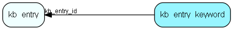

# kb\_entry\_keyword Table (288)

This table contains all keywords for the faq entries

## Fields

| Name | Description | Type | Null |
|------|-------------|------|:----:|
|id|The primary key (auto-incremented)|PK| |
|kb\_entry\_id|The id of the kb_entry which this keyword belongs to.|FK [kb_entry](kb-entry.md)| |
|keyword|A keyword for the given entry.|String(255)| |

[!include[details](./includes/kb-entry-keyword.md)]

## Indexes

| Fields | Types | Description |
|--------|-------|-------------|
|id |PK |Clustered, Unique |
|kb\_entry\_id |FK |Index |
|keyword |String(255) |Index |

## Relationships

| Table|  Description |
|------|-------------|
|[kb\_entry](kb-entry.md)  |This table contains FAQ entries. |

## Replication Flags

* None

## Security Flags

* No access control via user's Role.

