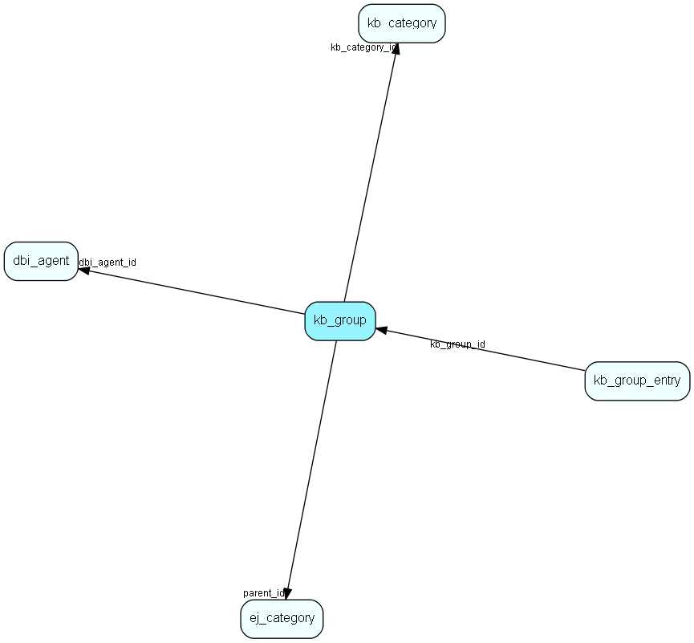

# kb\_group Table (286)

This table contains FAQ groups. A group is a cluster of entries (potentially located anywhere in the FAQ hierarchy). A group is located in a certain category.

## Fields

| Name | Description | Type | Null |
|------|-------------|------|:----:|
|id|The primary key (auto-incremented)|PK| |
|kb\_category\_id|The id of the kb_category in which this group is located.|FK [kb_category](kb-category.md)| |
|description|The description for this group.|Clob|&#x25CF;|
|dbi\_agent\_id|Integration agent (eJournal)|FK [dbi_agent](dbi-agent.md)| |
|dbi\_key|The primary key for the integrated entry in the external datasource.|String(255)| |
|dbi\_last\_syncronized|Last external syncronization.|DateTime| |
|dbi\_last\_modified|When the entry was last modified.|DateTime| |
|parent\_id|The parent group for this group. -1 if this is a toplevel group.|FK [ej_category](ej-category.md)| |

[!include[details](./includes/kb-group.md)]

## Indexes

| Fields | Types | Description |
|--------|-------|-------------|
|id |PK |Clustered, Unique |
|kb\_category\_id |FK |Index |
|dbi\_agent\_id |FK |Index |
|dbi\_key |String(255) |Index |
|dbi\_last\_syncronized |DateTime |Index |
|dbi\_last\_modified |DateTime |Index |
|parent\_id |FK |Index |

## Relationships

| Table|  Description |
|------|-------------|
|[dbi\_agent](dbi-agent.md)  |DBI agent settings |
|[ej\_category](ej-category.md)  |This table contains categories, in which tickets are categorized. The categories are organized in a hierarchial manner. |
|[kb\_category](kb-category.md)  |Knowledge base folder hierarchy |
|[kb\_group\_entry](kb-group-entry.md)  |This table contains group entries for FAQ groups. |

## Replication Flags

* None

## Security Flags

* No access control via user's Role.

