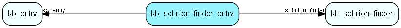

# kb\_solution\_finder\_entry Table (295)

Knowledge base problem solving wizard, items in a category linking to a knowledge base entry

## Fields

| Name | Description | Type | Null |
|------|-------------|------|:----:|
|id|The primary key (auto-incremented)|PK| |
|solution\_finder||FK [kb_solution_finder](kb-solution-finder.md)| |
|kb\_entry||FK [kb_entry](kb-entry.md)| |

[!include[details](./includes/kb-solution-finder-entry.md)]

## Indexes

| Fields | Types | Description |
|--------|-------|-------------|
|id |PK |Clustered, Unique |
|solution\_finder |FK |Index |
|kb\_entry |FK |Index |

## Relationships

| Table|  Description |
|------|-------------|
|[kb\_entry](kb-entry.md)  |This table contains FAQ entries. |
|[kb\_solution\_finder](kb-solution-finder.md)  |Knowledge base problem solving wizard, categories and subcategories for drilling down |

## Replication Flags

* None

## Security Flags

* No access control via user's Role.

