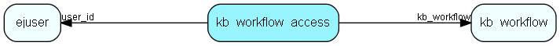

# kb\_workflow\_access Table (293)

Control of who can do what in a knowledge base workflow step

## Fields

| Name | Description | Type | Null |
|------|-------------|------|:----:|
|id|The primary key (auto-incremented)|PK| |
|kb\_workflow|The workflow to access.|FK [kb_workflow](kb-workflow.md)| |
|user\_id|The user with access.|FK [ejuser](ejuser.md)| |
|kb\_access|The access given to a user for entries in a given workflow phase. 1 for viewing entries, 2 for moving entries between workflow phases, 3 for editing entries|kb_access| |

[!include[details](./includes/kb-workflow-access.md)]

## Indexes

| Fields | Types | Description |
|--------|-------|-------------|
|id |PK |Clustered, Unique |
|kb\_workflow |FK |Index |
|user\_id |FK |Index |

## Relationships

| Table|  Description |
|------|-------------|
|[ejuser](ejuser.md)  |This table contains entries for the users of the system. |
|[kb\_workflow](kb-workflow.md)  |Knowledge base workflow steps |

## Replication Flags

* None

## Security Flags

* No access control via user's Role.

