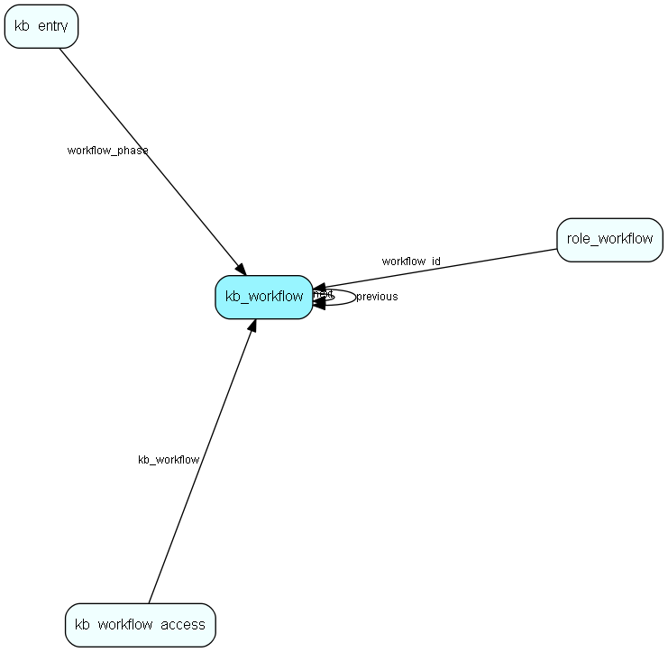

# kb\_workflow Table (292)

Knowledge base workflow steps

## Fields

| Name | Description | Type | Null |
|------|-------------|------|:----:|
|id|The primary key (auto-incremented)|PK| |
|next|The next workflow phase.|FK [kb_workflow](kb-workflow.md)| |
|previous|The previous workflow phase.|FK [kb_workflow](kb-workflow.md)| |
|name||String(255)|&#x25CF;|

[!include[details](./includes/kb-workflow.md)]

## Indexes

| Fields | Types | Description |
|--------|-------|-------------|
|id |PK |Clustered, Unique |
|next |FK |Index |
|previous |FK |Index |

## Relationships

| Table|  Description |
|------|-------------|
|[kb\_entry](kb-entry.md)  |This table contains FAQ entries. |
|[kb\_workflow](kb-workflow.md)  |Knowledge base workflow steps |
|[kb\_workflow\_access](kb-workflow-access.md)  |Control of who can do what in a knowledge base workflow step |
|[role\_workflow](role-workflow.md)  |Knowledge base workflow access rights associated with a role |

## Replication Flags

* None

## Security Flags

* No access control via user's Role.

