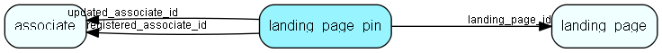

# landing\_page\_pin Table (499)

A pinned selection or entity record on a landing page

## Fields

| Name | Description | Type | Null |
|------|-------------|------|:----:|
|landing\_page\_pin\_id|Primary key|PK| |
|landing\_page\_id|The landing page this pin belongs to|FK [landing_page](landing-page.md)| |
|table\_number|Table number of the pinned record (selection table number, or entity table number such as contact, person, sale)|TableNumber| |
|record\_id|The id of the pinned record in the referenced table|RecordId| |
|registered|Registered when|UtcDateTime| |
|registered\_associate\_id|Registered by whom|FK [associate](associate.md)| |
|updated|Last updated when|UtcDateTime| |
|updated\_associate\_id|Last updated by whom|FK [associate](associate.md)| |
|updatedCount|Number of updates made to this record|UShort| |

[!include[details](./includes/landing-page-pin.md)]

## Indexes

| Fields | Types | Description |
|--------|-------|-------------|
|landing\_page\_id |FK |Index |
|landing\_page\_id, table\_number, record\_id |FK, TableNumber, RecordId |Unique |

## Relationships

| Table|  Description |
|------|-------------|
|[associate](associate.md)  |Employees, resources and other users - except for External persons |
|[landing\_page](landing-page.md)  |Per-associate landing page configuration for a given entity type |

## Replication Flags

* None

## Security Flags

* No access control via user's Role.

