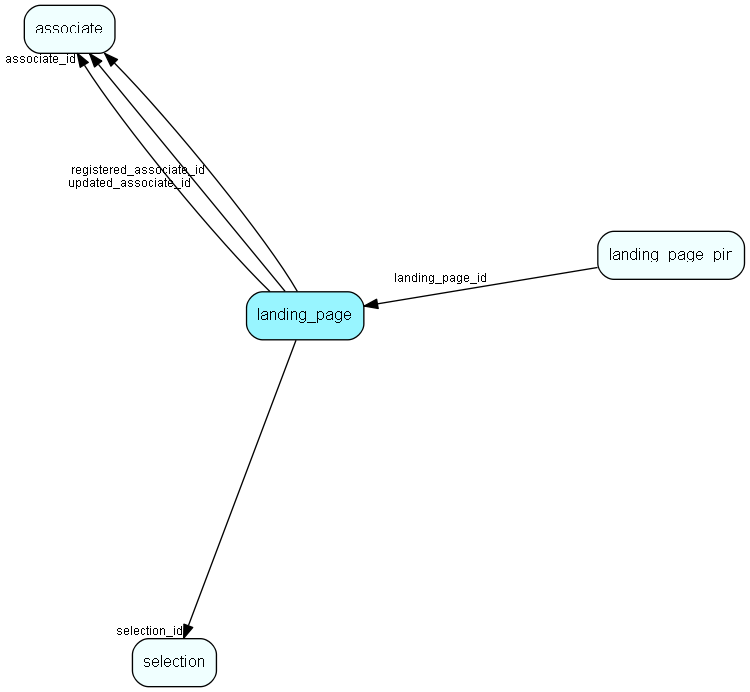

# landing\_page Table (497)

Per-associate landing page configuration for a given entity type

## Fields

| Name | Description | Type | Null |
|------|-------------|------|:----:|
|landing\_page\_id|Primary key|PK| |
|associate\_id|The associate this landing page belongs to|FK [associate](associate.md)| |
|entity\_table\_number|Table number identifying the entity (type of landing page)|TableNumber| |
|selection\_id|The selection to show on the landing page|FK [selection](selection.md)|&#x25CF;|
|registered|Registered when|UtcDateTime| |
|registered\_associate\_id|Registered by whom|FK [associate](associate.md)| |
|updated|Last updated when|UtcDateTime| |
|updated\_associate\_id|Last updated by whom|FK [associate](associate.md)| |
|updatedCount|Number of updates made to this record|UShort| |

[!include[details](./includes/landing-page.md)]

## Indexes

| Fields | Types | Description |
|--------|-------|-------------|
|associate\_id, entity\_table\_number |FK, TableNumber |Unique |

## Relationships

| Table|  Description |
|------|-------------|
|[associate](associate.md)  |Employees, resources and other users - except for External persons |
|[landing\_page\_pin](landing-page-pin.md)  |A pinned selection or entity record on a landing page |
|[selection](selection.md)  |Selections |

## Replication Flags

* None

## Security Flags

* No access control via user's Role.

