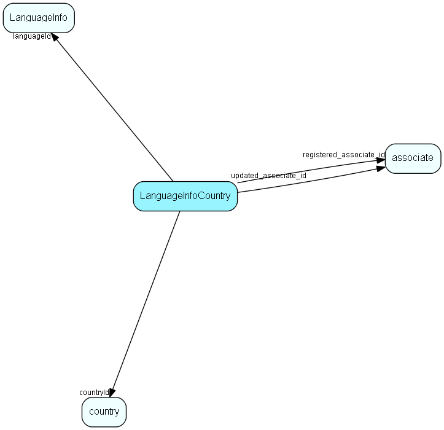

# LanguageInfoCountry Table (211)

Many-many link between countries and languages, to give intelligent choices for language

## Fields

| Name | Description | Type | Null |
|------|-------------|------|:----:|
|LanguageInfoCountry\_id|Primary key|PK| |
|languageId|Key to language|FK [LanguageInfo](languageinfo.md)| |
|countryId|Key to country|FK [country](country.md)| |
|percentage|Percentage of Country that speaks Language, 0 means we don&apos;t know|Short| |
|official|1: This is an official language; 2: it&apos;s not; 0: We don&apos;t know|Enum [OfficialLanguage](enums/officiallanguage.md)| |
|lcid|Language/culture as a string, such as en-us or nb-no|Id| |
|isDefault|If 1, this is the default language for the country|Bool| |
|registered|Registered when|UtcDateTime| |
|registered\_associate\_id|Registered by whom|FK [associate](associate.md)| |
|updated|Last updated when|UtcDateTime| |
|updated\_associate\_id|Last updated by whom|FK [associate](associate.md)| |
|updatedCount|Number of updates made to this record|UShort| |
|isBuiltIn|Has this row been inserted by SuperOffice priming data|UShort| |

[!include[details](./includes/languageinfocountry.md)]

## Indexes

| Fields | Types | Description |
|--------|-------|-------------|
|LanguageInfoCountry\_id |PK |Clustered, Unique |

## Relationships

| Table|  Description |
|------|-------------|
|[associate](associate.md)  |Employees, resources and other users - except for External persons |
|[country](country.md)  |Country information |
|[LanguageInfo](languageinfo.md)  |Information about languages, from ISO standards and related information |

## Replication Flags

* Replicate changes DOWN from central to satellites and travellers.
* Replicate changes UP from satellites and travellers back to central.
* Copy to satellite and travel prototypes.

## Security Flags

* No access control via user's Role.

