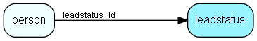

# leadstatus Table (540)

List items of lead status that is selectable for contacts and persons that have specific category

## Fields

| Name | Description | Type | Null |
|------|-------------|------|:----:|
|leadstatus\_id|Primary key|PK| |
|name|The list item|String(4000)| |
|rank|Rank order|UShort|&#x25CF;|
|tooltip|Tooltip or other description|String(4000)|&#x25CF;|
|deleted|0 -&gt; record is active 1 -&gt; record is &apos;deleted&apos; and should not be shown in lists|UShort|&#x25CF;|

[!include[details](./includes/leadstatus.md)]

## Indexes

| Fields | Types | Description |
|--------|-------|-------------|
|leadstatus\_id |PK |Clustered, Unique |
|name |String(4000) |Unique |

## Relationships

| Table|  Description |
|------|-------------|
|[AutomatedCategoryUpdate](automatedcategoryupdate.md)  |Info on how to autoupdate category when changing sale or leadstatus on person |
|[person](person.md)  |Persons |

## Replication Flags

* None

## Security Flags

* No access control via user's Role.

