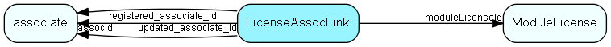

# LicenseAssocLink Table (238)

Link between ModuleLicense and Associate, for per-assoc licenses; this is how licenses are assigned/consumed

## Fields

| Name | Description | Type | Null |
|------|-------------|------|:----:|
|LicenseAssocLink\_id|Primary key|PK| |
|moduleLicenseId|The license being linked|FK [ModuleLicense](modulelicense.md)| |
|assocId|The associate who occupies one instance of this license|FK [associate](associate.md)| |
|validFrom|Reserved field: Valid from date|DateTime| |
|validTo|Reserved field: Valid to date|DateTime| |
|licenseNumber|Number of license items occupied by this associate - each module will have to decide on the semantics of this|UInt| |
|comment|Optional comment field|String(254)| |
|encryptedCheck|Encrypted checksum; tampering will block system usage|String(254)| |
|registered|Registered when|UtcDateTime| |
|registered\_associate\_id|Registered by whom|FK [associate](associate.md)| |
|updated|Last updated when|UtcDateTime| |
|updated\_associate\_id|Last updated by whom|FK [associate](associate.md)| |
|updatedCount|Number of updates made to this record|UShort| |

[!include[details](./includes/licenseassoclink.md)]

## Indexes

| Fields | Types | Description |
|--------|-------|-------------|
|LicenseAssocLink\_id |PK |Clustered, Unique |
|moduleLicenseId, assocId |FK, FK |Unique |

## Relationships

| Table|  Description |
|------|-------------|
|[associate](associate.md)  |Employees, resources and other users - except for External persons |
|[ModuleLicense](modulelicense.md)  |Module licenses, belonging to one single owner |

## Replication Flags

* Area Management controlled table. Contents replicated to satellites and traveller databases.
* Copy to satellite and travel prototypes.

## Security Flags

* Sentry controls access to items in this table using user's Role and data rights matrix on the table's parent.

