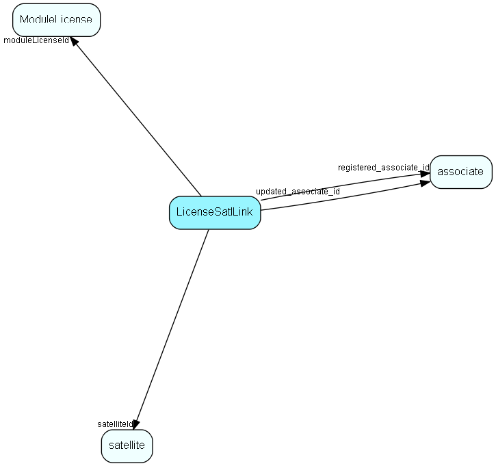

# LicenseSatlLink Table (239)

Link between License and Satellite, for per-database licenses

## Fields

| Name | Description | Type | Null |
|------|-------------|------|:----:|
|LicenseSatlLink\_id|Primary key|PK| |
|moduleLicenseId|The license being linked|FK [ModuleLicense](modulelicense.md)| |
|satelliteId|The Satellite who occupies one instance of this license|FK [satellite](satellite.md)| |
|validFrom|Reserved field: Valid from date|DateTime| |
|validTo|Reserved field: Valid to date|DateTime| |
|licenseNumber|Number of license items occupied by this satellite|UInt| |
|comment|Optional comment field|String(254)| |
|encryptedCheck|Encrypted checksum; tampering will block system usage|String(254)| |
|registered|Registered when|UtcDateTime| |
|registered\_associate\_id|Registered by whom|FK [associate](associate.md)| |
|updated|Last updated when|UtcDateTime| |
|updated\_associate\_id|Last updated by whom|FK [associate](associate.md)| |
|updatedCount|Number of updates made to this record|UShort| |

[!include[details](./includes/licensesatllink.md)]

## Indexes

| Fields | Types | Description |
|--------|-------|-------------|
|LicenseSatlLink\_id |PK |Clustered, Unique |
|moduleLicenseId, satelliteId |FK, FK |Unique |

## Relationships

| Table|  Description |
|------|-------------|
|[associate](associate.md)  |Employees, resources and other users - except for External persons |
|[ModuleLicense](modulelicense.md)  |Module licenses, belonging to one single owner |
|[satellite](satellite.md)  |Definition of Satellites |

## Replication Flags

* Replicate changes DOWN from central to satellites and travellers.
* Copy to satellite and travel prototypes.

## Security Flags

* Sentry controls access to items in this table using user's Role and data rights matrix on the table's parent.

