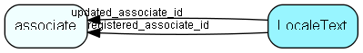

# LocaleText Table (169)

Multi-language text items. Used for user-defined field labels. Must be assigned correct name to match the language they start SuperOffice in.  This table should be viewed in conjunction with FieldLabel. If a row in FieldLable has active = 1 this table will need to contain at least one row with the same resourceId as the FieldLabel row. The language id can be either 0 or one of the Windows language ID&apos;s; SuperOffice will pick the correct language on startup according to the user settings. If a label cannot be found with the given language and also not with language 0, it will not be substituted. 

## Fields

| Name | Description | Type | Null |
|------|-------------|------|:----:|
|LocaleText\_id|Primary key|PK| |
|languageId|Language ID|Id| |
|typeId|1=label 2=table 3=column 4=import field 5=import object 6=import GUI category 7=contact udef label 8=role name, 9 = role tooltip, 10 = functionright label, 11 = functionright descriptionid; 12=function right description; 16=status monitor name; 19=contact udef label; 20=person udef label; 21=project udef label; 22=sale udef label; 23=appointment udef label; 24=document udef label; 31=tzlocation city|UShort| |
|resourceId|Resource ID|Id| |
|text|The text string itself|String(254)|&#x25CF;|
|registered|Registered when|UtcDateTime| |
|registered\_associate\_id|Registered by whom|FK [associate](associate.md)| |
|updated|Last updated when|UtcDateTime| |
|updated\_associate\_id|Last updated by whom|FK [associate](associate.md)| |
|updatedCount|Number of updates made to this record|UShort| |
|isBuiltin|1 = this row is populated and maintained by SuperOffice|UShort|&#x25CF;|

[!include[details](./includes/localetext.md)]

## Indexes

| Fields | Types | Description |
|--------|-------|-------------|
|LocaleText\_id |PK |Unique |
|resourceId |Id |Index |
|languageId, typeId, resourceId |Id, UShort, Id |Clustered, Unique |

## Relationships

| Table|  Description |
|------|-------------|
|[associate](associate.md)  |Employees, resources and other users - except for External persons |

## Replication Flags

* Replicate changes DOWN from central to satellites and travellers.
* Replicate changes UP from satellites and travellers back to central.
* Copy to satellite and travel prototypes.

## Security Flags

* No access control via user's Role.

