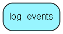

# log\_events Table (364)

System log

## Fields

| Name | Description | Type | Null |
|------|-------------|------|:----:|
|id|Primary key|PK| |
|time\_of\_event|When did the event take place|DateTime|&#x25CF;|
|event\_type|Notification=1, warning=2, error=3, critical error=4|Int|&#x25CF;|
|event\_group|See NewLog::EventGroup|Int|&#x25CF;|
|event\_id|See NewLog::EventId|Int|&#x25CF;|
|target\_id|The id of the target entity (ticket.id, customer.id etc)|Int|&#x25CF;|
|var1|Dynamic info|Clob|&#x25CF;|
|var2|Dynamic info|Clob|&#x25CF;|
|var3|Dynamic info|Clob|&#x25CF;|
|var4|Dynamic info|Clob|&#x25CF;|
|var5|Dynamic info|Clob|&#x25CF;|
|source\_user|The user generating the event. 1=system, other=ejuser.id|Int|&#x25CF;|
|source\_user\_desc|Describing the id in source_user. eg user name or customer name or (System)|Clob|&#x25CF;|

[!include[details](./includes/log-events.md)]

## Indexes

| Fields | Types | Description |
|--------|-------|-------------|
|id |PK |Clustered, Unique |

## Replication Flags

* None

## Security Flags

* No access control via user's Role.

