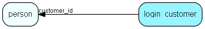

# login\_customer Table (298)

This table contains entries for customer sessions. At first only used for Soap logins, but will later also be used for web logins

## Fields

| Name | Description | Type | Null |
|------|-------------|------|:----:|
|id|The primary key (auto-incremented)|PK| |
|customer\_id|The id of the customer this entry references.|FK [person](person.md)| |
|session\_key|A random 32 characters value used as authentication key for the session.|String(32)| |
|expire|The last time this session was active.|DateTime|&#x25CF;|
|seconds\_to\_live|The session key will expire after a given number of seconds.|Int| |
|remote\_addr|For future use: The IP address of the client for this session.|String(64)|&#x25CF;|
|remote\_host|For future use: The hostname (depending on whether reverse lookup is enabled in httpd) or IP address of the client for this session.|String(64)|&#x25CF;|
|error\_message|Stores the last error message recorded on this session|String(255)|&#x25CF;|
|origin|1=soap call, 2=customer pages|Int| |
|created\_at|When the entry was created|DateTime|&#x25CF;|

[!include[details](./includes/login-customer.md)]

## Indexes

| Fields | Types | Description |
|--------|-------|-------------|
|id |PK |Clustered, Unique |
|customer\_id |FK |Index |
|session\_key |String(32) |Index |
|origin |Int |Index |

## Relationships

| Table|  Description |
|------|-------------|
|[person](person.md)  |Persons in a company or an organizations. All associates have a corresponding person record |

## Replication Flags

* None

## Security Flags

* No access control via user's Role.

