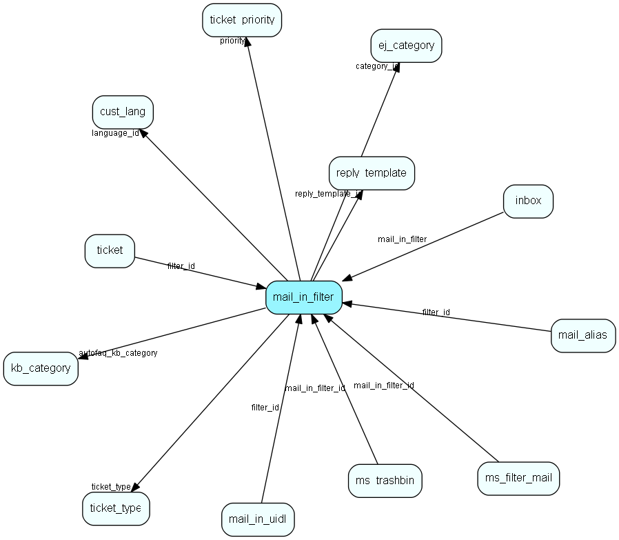

# mail\_in\_filter Table (271)

This table contains entries for the mailboxes the eJournal system is fetching mail from (POP3 or IMAP).

## Fields

| Name | Description | Type | Null |
|------|-------------|------|:----:|
|id|The primary key (auto-incremented)|PK| |
|server\_type|Enum indicating the protocol to use (POP/IMAP).|Enum [MailboxType](enums/mailboxtype.md)|&#x25CF;|
|pop\_server|The hostname/IP address of the server.|String(255)|&#x25CF;|
|pop\_user|The username used to login.|String(255)|&#x25CF;|
|pop\_password|The password used to login.|String(255)|&#x25CF;|
|domain|The domain used to login.|String(255)|&#x25CF;|
|address|The address associated with this mailbox (used as FROM: address when sending emails).|String(255)|&#x25CF;|
|category\_id|The id of the category this mailbox assigns tickets to (unless overridden by a sortfilter).|FK [ej_category](ej-category.md)|&#x25CF;|
|priority|The id of the priority tickets are assigned when imported from this mailbox.|FK [ticket_priority](ticket-priority.md)|&#x25CF;|
|reply\_template\_id|ID of the reply template used on this mail box.|FK [reply_template](reply-template.md)| |
|checkwait|How often (in minutes) to check this mailbox.|Int| |
|next\_check|When this mailbox should be checked the next time.|DateTime|&#x25CF;|
|noautoreply|If set, then this mailbox should not send an autoreply.|Bool|&#x25CF;|
|last\_success|Datetime indicating the last time email was sucessfully imported from this mailbox. Used to display warnings when this value is getting too old.|DateTime|&#x25CF;|
|last\_try|Datetime indicating the last time this mailbox tried (but possibly failed) to fetch email.|DateTime|&#x25CF;|
|importmail\_pid|The process id of the importMail instance processing this mailbox|Int|&#x25CF;|
|status|Status indicated whether this mailbox is deleted or not.|status|&#x25CF;|
|last\_error|The last error message recieved from the underlying email system (such as POP3 protocol errors, etc).|Clob|&#x25CF;|
|num\_seq\_failures|The number of sequential failures for this mailbox.|Int|&#x25CF;|
|keep\_headers|A commaseparated list of headers to store for emails imported. E.g. &amp;apos;to,from,recieved-by,subject&amp;apos;. |String(255)|&#x25CF;|
|language\_id|The id of the customer language entry this entry is connected to.|FK [cust_lang](cust-lang.md)|&#x25CF;|
|autofaq|Whether to suggest FAQ entries for this email account or not|Bool|&#x25CF;|
|autofaq\_kb\_category|The root folder for the auto faq search.|FK [kb_category](kb-category.md)|&#x25CF;|
|mailgun\_dsn|If this is set to 1, the route created in Mailgun will be set up to deliver emails of type auto-replies, system messsages etc|Bool|&#x25CF;|
|ai\_suggest\_category|If this is set to 0 (false), then there will be no AI for suggesting categories on incoming emails|Bool| |
|ai\_text\_analysis|If this is set to 0 (false), then there will be no AI text analysis on incoming emails|Bool| |
|ticket\_type|Tickettype of the ticket|FK [ticket_type](ticket-type.md)|&#x25CF;|

[!include[details](./includes/mail-in-filter.md)]

## Indexes

| Fields | Types | Description |
|--------|-------|-------------|
|id |PK |Clustered, Unique |
|category\_id |FK |Index |
|priority |FK |Index |
|reply\_template\_id |FK |Index |
|language\_id |FK |Index |

## Relationships

| Table|  Description |
|------|-------------|
|[cust\_lang](cust-lang.md)  |This table contains entries for customer languages. |
|[ej\_category](ej-category.md)  |This table contains categories, in which tickets are categorized. The categories are organized in a hierarchial manner. |
|[inbox](inbox.md)  |Info and status for safe email import |
|[kb\_category](kb-category.md)  |Knowledge base folder hierarchy |
|[mail\_alias](mail-alias.md)  |This table contains the alias&amp;apos;es for each mailbox, one-to-many-relation. It is in so we can substract the alias&amp;apos;es when when listing the recipients of a message.      |
|[mail\_in\_uidl](mail-in-uidl.md)  |This table is used to avoid spamming the system by importing the same message several times (normally a result of a crash somewhere). When a mailbox is openede, then unique id for each message is stored in this table, and then removed only when the message has been correctly imported and deleted from mailbox. |
|[ms\_filter\_mail](ms-filter-mail.md)  |This table connects mail filters (ms_filter) to mailboxes (mail_in_filter). |
|[ms\_trashbin](ms-trashbin.md)  |This table contains entries for emails which have been trashed by a filter, waiting for confirmation of deletion or import. |
|[reply\_template](reply-template.md)  |Templates for automatic and manual replies to emails/sms organized hierachically |
|[ticket](ticket.md)  |This table contains the tickets (requests) of the system. Its purpose should be evident. |
|[ticket\_priority](ticket-priority.md)  |This table contains the ticket priorities. |
|[ticket\_type](ticket-type.md)  |A ticket (request) type |

## Replication Flags

* None

## Security Flags

* No access control via user's Role.

