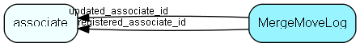

# MergeMoveLog Table (37)

Log of merge and move operations (person, contact, project)

## Fields

| Name | Description | Type | Null |
|------|-------------|------|:----:|
|MergeMoveLog\_id|Primary key|PK| |
|tableNumber|Number of table where the move/merge happened|TableNumber| |
|operation|Operation type enumerator|UShort| |
|sourceRecord|Source record id|Id| |
|destinationRecord|Destination record id|Id| |
|options|Options relating to move of activities and other side effects|String(2047)|&#x25CF;|
|registered|Registered when|UtcDateTime| |
|registered\_associate\_id|Registered by whom|FK [associate](associate.md)| |
|updated|Last updated when|UtcDateTime| |
|updated\_associate\_id|Last updated by whom|FK [associate](associate.md)| |
|updatedCount|Number of updates made to this record|UShort| |

[!include[details](./includes/mergemovelog.md)]

## Indexes

| Fields | Types | Description |
|--------|-------|-------------|
|MergeMoveLog\_id |PK |Clustered, Unique |
|tableNumber |TableNumber |Index |
|operation |UShort |Index |

## Relationships

| Table|  Description |
|------|-------------|
|[associate](associate.md)  |Employees, resources and other users - except for External persons |

## Replication Flags

* Replicate changes DOWN from central to satellites and travellers.
* Replicate changes UP from satellites and travellers back to central.
* Copy to satellite and travel prototypes.

## Security Flags

* No access control via user's Role.

