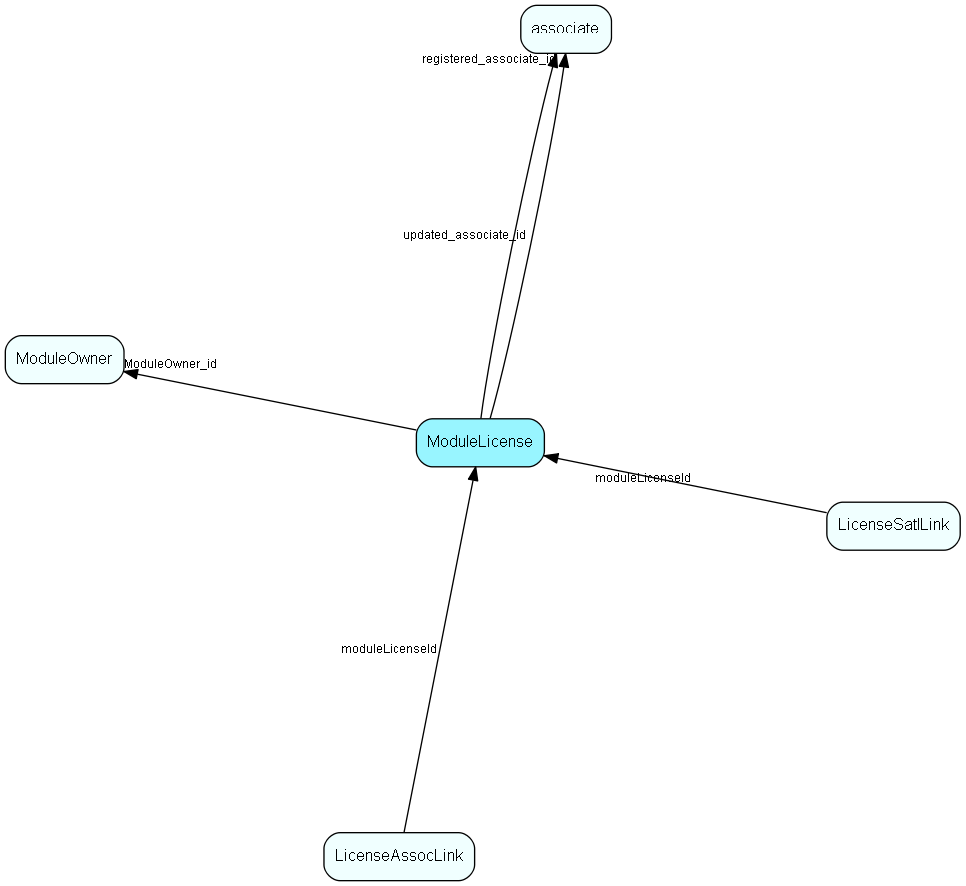

# ModuleLicense Table (237)

Module licenses, belonging to one single owner

## Fields

| Name | Description | Type | Null |
|------|-------------|------|:----:|
|ModuleLicense\_id|Primary key|PK| |
|moduleName|The name of the module, not visible in GUI but used in the code. This must be in UPPER CASE and only contain A-Z and 0-9. NO EXTENDED CHARACTERS please.|String(239)| |
|moduleDescription|Human-readable description of module, shown in GUI, default language. Additional languages can be added to LocaleText, resource type 25|String(254)| |
|moduleVersion|Version string for this module|String(254)|&#x25CF;|
|tooltip|Tooltip text, anything you want; shown when the cursor hovers over the line in the GUI. Default language. Additional languages can be added to LocaleText, resource type 27|String(254)| |
|licenseType|Entire system, per database, or per associate|Enum [LicenseType](enums/licensetype.md)| |
|licenseNumber|Number of systems, databases or associates licensed|UInt| |
|allowedAssocsMask|Bitmask of allowed associate types who can have this kind of license|UInt| |
|extraFlags|Unspecified extra flags of license, part of checksum. Value=1 means this a &apos;user plan&apos;; such licenses cause the admin gui to switch to radiobutton view|UInt| |
|extraInfo|Free field, can be used by the module owner (example: host domain, for eJournal). NOTE: For rows with extraFlags=1 this field contains the list of modules that this plan comprises|String(3999)|&#x25CF;|
|encryptedCheck|Encrypted checksum that stops tampering and copying between databases|String(254)| |
|registered|Registered when|UtcDateTime| |
|registered\_associate\_id|Registered by whom|FK [associate](associate.md)| |
|updated|Last updated when|UtcDateTime| |
|updated\_associate\_id|Last updated by whom|FK [associate](associate.md)| |
|updatedCount|Number of updates made to this record|UShort| |
|ModuleOwner\_id|Link to owner of this module|FK [ModuleOwner](moduleowner.md)| |
|sortOrder|Ordering value - generated by SuperLicense and transferred here. Must be followed for signatures to be correct|Id|&#x25CF;|
|signature|Signature that verifies that this row is correctly transferred from SuperLicense|String(254)|&#x25CF;|
|unrestricted|If true, then there is no licenseNumber limit on how many of these modules may be assigned|Bool|&#x25CF;|
|hidden|If true, then this module should not appear in GUI and is not assignable by users|Bool|&#x25CF;|
|prerequisiteModule|If set, specifies a module license needed before this license can be granted|String(239)|&#x25CF;|

[!include[details](./includes/modulelicense.md)]

## Indexes

| Fields | Types | Description |
|--------|-------|-------------|
|ModuleLicense\_id |PK |Clustered, Unique |
|moduleName, moduleVersion, ModuleOwner\_id |String(239), String(254), FK |Unique |

## Relationships

| Table|  Description |
|------|-------------|
|[associate](associate.md)  |Employees, resources and other users - except for External persons |
|[LicenseAssocLink](licenseassoclink.md)  |Link between ModuleLicense and Associate, for per-assoc licenses; this is how licenses are assigned/consumed |
|[LicenseSatlLink](licensesatllink.md)  |Link between License and Satellite, for per-database licenses |
|[ModuleOwner](moduleowner.md)  |Unique owner of a set of licensed modules |

## Replication Flags

* Replicate changes DOWN from central to satellites and travellers.
* Copy to satellite and travel prototypes.

## Security Flags

* No access control via user's Role.

