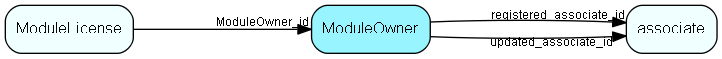

# ModuleOwner Table (212)

Unique owner of a set of licensed modules

## Fields

| Name | Description | Type | Null |
|------|-------------|------|:----:|
|ModuleOwner\_id|Primary key|PK| |
|ownerName|The name of the module owner, not visible in GUI but used in the code. OwnerName SUPEROFFICE is reserved and may NEVER be used by partners. This must be in UPPER CASE and only contain A-Z and 0-9. NO EXTENDED CHARACTERS please.|String(239)| |
|ownerDescription|Human-readable description of owner, shown in GUI, default language. Additional languages can be added to LocaleText, resource type 26|String(254)| |
|licenseUrl|The url that will provide keycodes for all modules owned by this owner|String(254)| |
|licenseVersion|The url that will provide keycodes for all modules owned by this owner|String(254)| |
|signedPublicKey|The public key used to verify licenses owned by this owner|Blob| |
|signature|Signature of all non-zero-amount moduleLicense rows referring to this owner|String(254)| |
|deploymentType|Type of deployment|Id|&#x25CF;|
|productType|Type of product|String(254)|&#x25CF;|
|productTypeDescription|Description of type of product|String(254)|&#x25CF;|
|extraFlags|Unspecified extra flags of license, part of checksum|UInt| |
|extraInfo|Free field, can be used by the module owner (example: host domain, for eJournal)|String(254)|&#x25CF;|
|expiration|Expiration date, 0 = forever|DateTime| |
|graceTo|Real expiration date, when the given module actually stops working. Modules that normally update data should switch to read-only mode. Modules that only read anyway, should disable themselves in some other way|DateTime| |
|maintenanceTo|Expiration date for maintenance. After this date, upgrades should refuse to install.|DateTime| |
|nextCheckDate|When should the system next check with the license issuer|DateTime|&#x25CF;|
|adminWarningDate|When should nagging begin (for instance, during login to SoAdmin)|DateTime|&#x25CF;|
|encryptedCheck|Encrypted checksum that stops tampering and copying between databases|String(254)| |
|registered|Registered when|UtcDateTime| |
|registered\_associate\_id|Registered by whom|FK [associate](associate.md)| |
|updated|Last updated when|UtcDateTime| |
|updated\_associate\_id|Last updated by whom|FK [associate](associate.md)| |
|updatedCount|Number of updates made to this record|UShort| |

[!include[details](./includes/moduleowner.md)]

## Indexes

| Fields | Types | Description |
|--------|-------|-------------|
|ModuleOwner\_id |PK |Clustered, Unique |
|ownerName |String(239) |Unique |

## Relationships

| Table|  Description |
|------|-------------|
|[associate](associate.md)  |Employees, resources and other users - except for External persons |
|[ModuleLicense](modulelicense.md)  |Module licenses, belonging to one single owner |

## Replication Flags

* Replicate changes DOWN from central to satellites and travellers.
* Copy to satellite and travel prototypes.

## Security Flags

* No access control via user's Role.

