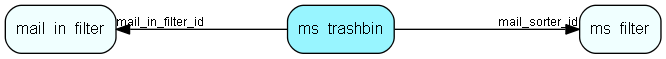

# ms\_trashbin Table (312)

This table contains entries for emails which have been trashed by a filter, waiting for confirmation of deletion or import.

## Fields

| Name | Description | Type | Null |
|------|-------------|------|:----:|
|id|The primary key (auto-incremented)|PK| |
|mail\_sorter\_id|The id of the filter which sent this email to the trashbin.|FK [ms_filter](ms-filter.md)| |
|mail\_in\_filter\_id|The id of the mailbox from which this email came.|FK [mail_in_filter](mail-in-filter.md)| |
|when\_trashed|When the email was trashed by the filter.|DateTime|&#x25CF;|
|subject|The subject field of the trashed email|String(255)|&#x25CF;|

[!include[details](./includes/ms-trashbin.md)]

## Indexes

| Fields | Types | Description |
|--------|-------|-------------|
|id |PK |Clustered, Unique |
|mail\_sorter\_id |FK |Index |
|mail\_in\_filter\_id |FK |Index |

## Relationships

| Table|  Description |
|------|-------------|
|[mail\_in\_filter](mail-in-filter.md)  |This table contains entries for the mailboxes the eJournal system is fetching mail from (POP3 or IMAP). |
|[ms\_filter](ms-filter.md)  |This table contains email filters. These are the filters allowing you to do advanced parsing of incomming emails. |

## Replication Flags

* None

## Security Flags

* No access control via user's Role.

