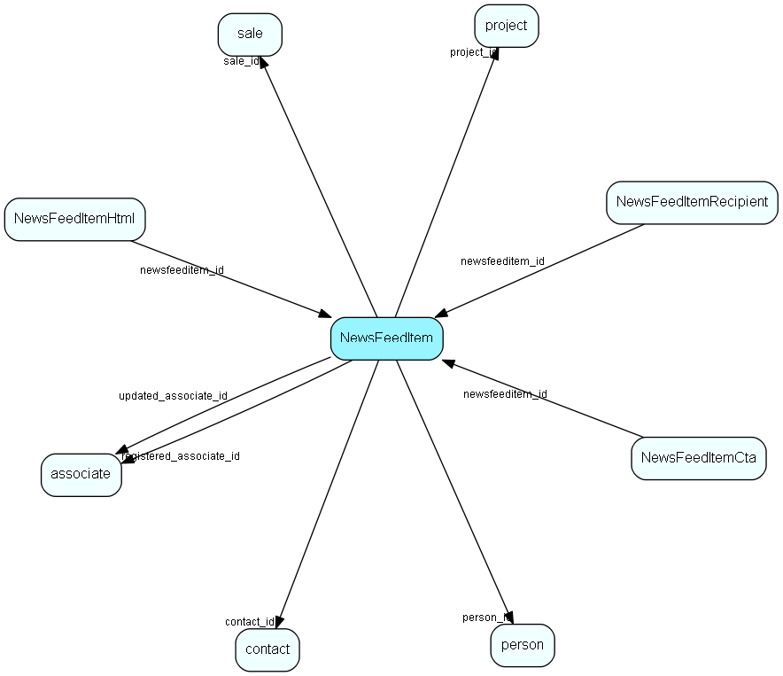

# NewsFeedItem Table (505)

Contains news feed items - published to one or more users, with one or more language descriptions

## Fields

| Name | Description | Type | Null |
|------|-------------|------|:----:|
|newsfeeditem\_id|Primary key|PK| |
|Title|Short, descriptive headline. Plain text title. Multi-language string supported: &apos;US:&quot;english&quot;;NO:&quot;norsk&quot;&apos;.|String(1000)| |
|Summary|Short, descriptive summary. Plain text summary. Multi-language string supported: &apos;US:&quot;english&quot;;NO:&quot;norsk&quot;&apos;.|String(4000)| |
|ImageLink|URL Link to an image associated with the news item.|String(2000)| |
|SourceLink|URL Link to the source of the news item, or an SOProtocol link to a SuperOffice item|String(2000)| |
|PreviewHint|Preview hint for the news item. e.g. `{contact_id=123}`|String(100)| |
|FromName|Name of the instance that published this item. e.g. `Pete the prospector`|String(200)| |
|FromCategoryName|Type of the instance that published this item. e.g. `Prospector Agent`|String(200)| |
|Priority|Importance of the news item. Low to High. Higher priority items may be shown more prominently in the feed.|Enum [EMailPriority](enums/emailpriority.md)| |
|ExpiresAt|When the news item expires and should no longer be shown in feeds (UTC)|UtcDateTime|&#x25CF;|
|Status|Indicates if the item is being handled by a CTA. (normal, processing, processed)|Enum [NewsFeedItemStatus](enums/newsfeeditemstatus.md)| |
|contact\_id|Related contact id - 0 if not related to a contact|FK [contact](contact.md)| |
|person\_id|Related person id - 0 if not related to a person|FK [person](person.md)| |
|project\_id|Related project id - 0 if not related to a project|FK [project](project.md)| |
|sale\_id|Related sale id - 0 if not related to a sale|FK [sale](sale.md)| |
|ApplicationId|The id of the application that registered this news item. Used to resolve where any CTA should be posted when clicked.|String(100)| |
|registered|Registered when|UtcDateTime| |
|registered\_associate\_id|Registered by whom|FK [associate](associate.md)| |
|updated|Last updated when|UtcDateTime| |
|updated\_associate\_id|Last updated by whom|FK [associate](associate.md)| |
|updatedCount|Number of updates made to this record|UShort| |

[!include[details](./includes/newsfeeditem.md)]

## Indexes

| Fields | Types | Description |
|--------|-------|-------------|
|ExpiresAt |UtcDateTime |Index |
|contact\_id |FK |Index |
|person\_id |FK |Index |
|project\_id |FK |Index |
|sale\_id |FK |Index |
|registered |UtcDateTime |Index |

## Relationships

| Table|  Description |
|------|-------------|
|[associate](associate.md)  |Employees, resources and other users - except for External persons |
|[contact](contact.md)  |Companies and Organizations. |
|[NewsFeedItemCta](newsfeeditemcta.md)  |List of Calls-to-Action buttons to attach to a given news item. One item may have multiple CTAs (e.g. Approve + Reject). |
|[NewsFeedItemHtml](newsfeeditemhtml.md)  |Detailed description of the news item, in a specific language. |
|[NewsFeedItemRecipient](newsfeeditemrecipient.md)  |Recipients of the news feed item. One news feed item may be sent to multiple recipients (users). |
|[person](person.md)  |Persons |
|[project](project.md)  |Projects |
|[sale](sale.md)  |Sales  For every Sale record edited through the SuperOffice GUI, a copy of the current version of the record will be saved in the SaleHist table. This also applies to editing done through the SaleModel COM interface, but not to editing done through the OLE DB Provider or other channels.   |

## Replication Flags

* None

## Security Flags

* No access control via user's Role.

