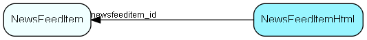

# NewsFeedItemHtml Table (506)

Detailed description of the news item, in a specific language.

## Fields

| Name | Description | Type | Null |
|------|-------------|------|:----:|
|newsfeeditemhtml\_id|Primary key|PK| |
|newsfeeditem\_id|Foreign key to NewsFeedItem that this description belongs to.|FK [NewsFeedItem](newsfeeditem.md)| |
|Iso2Lang|ISO 2 letter Language code for the content. &quot;en&quot;, &quot;us&quot;, &quot;no&quot;|String(10)| |
|HtmlContent|The HTML content for the news feed item in the specified language. Styling through pre-defined CSS classes. No SCRIPT or STYLE tags allowed|Clob| |

[!include[details](./includes/newsfeeditemhtml.md)]

## Indexes

| Fields | Types | Description |
|--------|-------|-------------|
|newsfeeditem\_id, Iso2Lang |FK, String(10) |Unique |

## Relationships

| Table|  Description |
|------|-------------|
|[NewsFeedItem](newsfeeditem.md)  |Contains news feed items - published to one or more users, with one or more language descriptions |

## Replication Flags

* None

## Security Flags

* No access control via user's Role.

