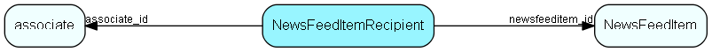

# NewsFeedItemRecipient Table (508)

Recipients of the news feed item. One news feed item may be sent to multiple recipients (users).

## Fields

| Name | Description | Type | Null |
|------|-------------|------|:----:|
|newsfeeditemrecipient\_id|Primary key|PK| |
|newsfeeditem\_id|Foreign key to NewsFeedItem that this recipient belongs to.|FK [NewsFeedItem](newsfeeditem.md)| |
|associate\_id|Foreign key to user that should receive this news item.|FK [associate](associate.md)| |
|IsRead|Set to true when the recipient user has read the news feed item.|Bool| |
|ReadAt|When the recipient user read the news feed item (UTC)|UtcDateTime|&#x25CF;|

[!include[details](./includes/newsfeeditemrecipient.md)]

## Indexes

| Fields | Types | Description |
|--------|-------|-------------|
|newsfeeditem\_id, associate\_id |FK, FK |Unique |

## Relationships

| Table|  Description |
|------|-------------|
|[associate](associate.md)  |Employees, resources and other users - except for External persons |
|[NewsFeedItem](newsfeeditem.md)  |Contains news feed items - published to one or more users, with one or more language descriptions |

## Replication Flags

* None

## Security Flags

* No access control via user's Role.

