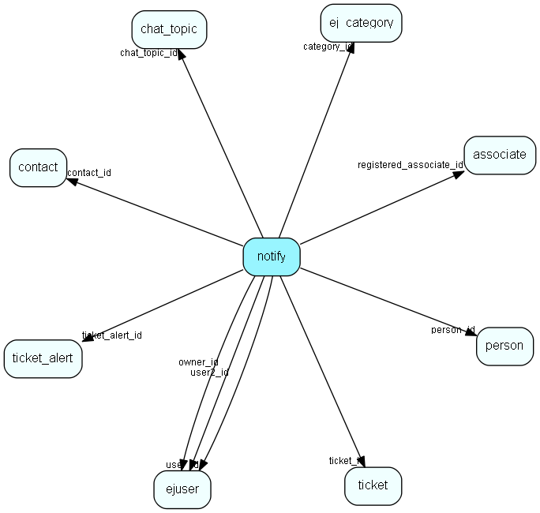

# notify Table (301)

This table contains the pop-up messages displayed for users for various events, such as &amp;apos;new ticket&amp;apos;, etc.

## Fields

| Name | Description | Type | Null |
|------|-------------|------|:----:|
|id|The primary key (auto-incremented)|PK| |
|type|A number (enum) indicating the type of the notification.|Int|&#x25CF;|
|expires|When the notification expires, if it has not yet been displayed.|DateTime|&#x25CF;|
|user\_id|The id of the user who should be notified.|FK [ejuser](ejuser.md)| |
|owner\_id|The id of the user who is the original owner of this notification.|FK [ejuser](ejuser.md)| |
|ticket\_id|The id of the ticket this notification message affects.|FK [ticket](ticket.md)| |
|user2\_id|A second user involved in this notification|FK [ejuser](ejuser.md)|&#x25CF;|
|category\_id|The category involed in this notification|FK [ej_category](ej-category.md)|&#x25CF;|
|chat\_topic\_id|Chat topic involed in this notification|FK [chat_topic](chat-topic.md)|&#x25CF;|
|chat\_nick\_name|Chat customer nick name in this notification|String(255)|&#x25CF;|
|ticket\_alert\_id|Ticket alert used when tickets are escalated|FK [ticket_alert](ticket-alert.md)|&#x25CF;|
|custom\_message|Text for custom notify messages|String(255)|&#x25CF;|
|custom\_url|An URL which can be set with custom notification messages|String(2048)|&#x25CF;|
|registered|Registered when|UtcDateTime|&#x25CF;|
|registered\_associate\_id|Registered by whom|FK [associate](associate.md)|&#x25CF;|

[!include[details](./includes/notify.md)]

## Indexes

| Fields | Types | Description |
|--------|-------|-------------|
|id |PK |Clustered, Unique |
|user\_id |FK |Index |
|owner\_id |FK |Index |
|ticket\_id |FK |Index |
|user2\_id |FK |Index |
|category\_id |FK |Index |
|chat\_topic\_id |FK |Index |
|ticket\_alert\_id |FK |Index |

## Relationships

| Table|  Description |
|------|-------------|
|[associate](associate.md)  |Employees, resources and other users - except for External persons |
|[chat\_topic](chat-topic.md)  |This table contains chat topics. |
|[ej\_category](ej-category.md)  |This table contains categories, in which tickets are categorized. The categories are organized in a hierarchial manner. |
|[ejuser](ejuser.md)  |This table contains entries for the users of the system. |
|[ticket](ticket.md)  |This table contains the tickets (requests) of the system. Its purpose should be evident. |
|[ticket\_alert](ticket-alert.md)  |This table will contain ticket escalation levels. A ticket will be escalated along a &amp;apos;chain&amp;apos; of these levels. |

## Replication Flags

* None

## Security Flags

* No access control via user's Role.

