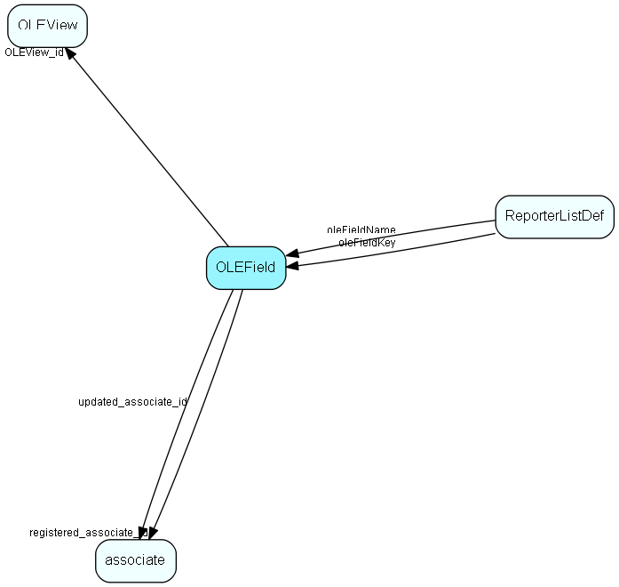

# OLEField Table (165)

Control data table for the OLE DB Provider

## Fields

| Name | Description | Type | Null |
|------|-------------|------|:----:|
|OLEField\_id|Primary key|PK| |
|OLEView\_id|Owner subject|FK [OLEView](oleview.md)| |
|fieldId|SODBIF field ID (including table!)|FieldId| |
|predefined|1 = predefined subject, do not change|UShort| |
|datatype|Data type, same as in dictionary|UShort| |
|length|Size of data in result buffer|UShort| |
|algoType|Algorithm - how data is transferred from source field to result. 4 = copy from source buffer. 2 = associate name, 3 = person name|UShort|&#x25CF;|
|algoData|Source field or other parameter to algorithm in AlgoType. |UInt|&#x25CF;|
|searchable|Is the field searchable (and shown as such in the reporter)|UShort|&#x25CF;|
|registered|Registered when|UtcDateTime| |
|registered\_associate\_id|Registered by whom|FK [associate](associate.md)| |
|updated|Last updated when|UtcDateTime| |
|updated\_associate\_id|Last updated by whom|FK [associate](associate.md)| |
|updatedCount|Number of updates made to this record|UShort| |

[!include[details](./includes/olefield.md)]

## Indexes

| Fields | Types | Description |
|--------|-------|-------------|
|OLEField\_id |PK |Clustered, Unique |
|OLEView\_id |FK |Index |
|fieldId |FieldId |Index |
|OLEView\_id, fieldId |FK, FieldId |Index |

## Relationships

| Table|  Description |
|------|-------------|
|[associate](associate.md)  |Employees, resources and other users - except for External persons |
|[OLEView](oleview.md)  |Control data table for the OLE DB Provider |
|[ReporterListDef](reporterlistdef.md)  |Reporter definitions |

## Replication Flags

* Replicate changes DOWN from central to satellites and travellers.
* Replicate changes UP from satellites and travellers back to central.
* Copy to satellite and travel prototypes.

## Security Flags

* No access control via user's Role.

