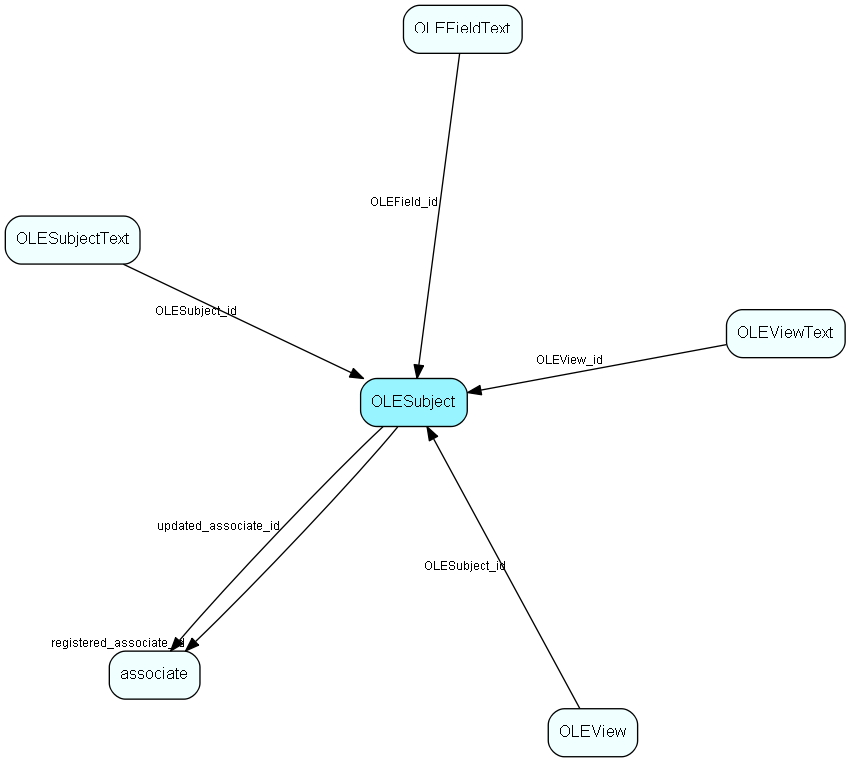

# OLESubject Table (161)

Control data table for the OLE DB Provider

## Fields

| Name | Description | Type | Null |
|------|-------------|------|:----:|
|OLESubject\_id|Primary key|PK| |
|predefined|1 = predefined subject, do not change|UShort|&#x25CF;|
|registered|Registered when|UtcDateTime| |
|registered\_associate\_id|Registered by whom|FK [associate](associate.md)| |
|updated|Last updated when|UtcDateTime| |
|updated\_associate\_id|Last updated by whom|FK [associate](associate.md)| |
|updatedCount|Number of updates made to this record|UShort| |

[!include[details](./includes/olesubject.md)]

## Indexes

| Fields | Types | Description |
|--------|-------|-------------|
|OLESubject\_id |PK |Clustered, Unique |

## Relationships

| Table|  Description |
|------|-------------|
|[associate](associate.md)  |Employees, resources and other users - except for External persons |
|[OLEFieldText](olefieldtext.md)  |Control data table for the OLE DB Provider |
|[OLESubjectText](olesubjecttext.md)  |Control data table for the OLE DB Provider |
|[OLEView](oleview.md)  |Control data table for the OLE DB Provider |
|[OLEViewText](oleviewtext.md)  |Control data table for the OLE DB Provider |

## Replication Flags

* Replicate changes DOWN from central to satellites and travellers.
* Replicate changes UP from satellites and travellers back to central.
* Copy to satellite and travel prototypes.

## Security Flags

* No access control via user's Role.

