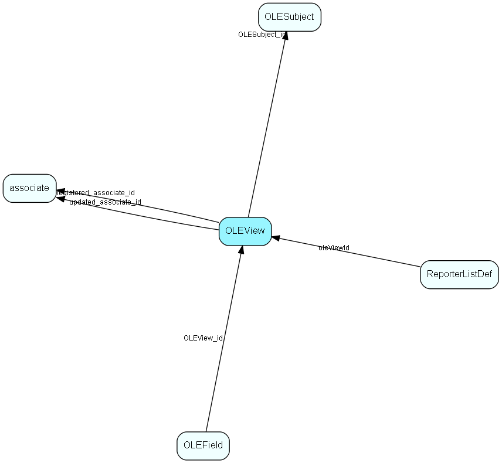

# OLEView Table (163)

Control data table for the OLE DB Provider

## Fields

| Name | Description | Type | Null |
|------|-------------|------|:----:|
|OLEView\_id|Primary key|PK| |
|OLESubject\_id|Owner subject|FK [OLESubject](olesubject.md)| |
|progId|GUID of the module that can perform this join|String(59)|&#x25CF;|
|predefined|1 = predefined subject, do not change|UShort|&#x25CF;|
|registered|Registered when|UtcDateTime| |
|registered\_associate\_id|Registered by whom|FK [associate](associate.md)| |
|updated|Last updated when|UtcDateTime| |
|updated\_associate\_id|Last updated by whom|FK [associate](associate.md)| |
|updatedCount|Number of updates made to this record|UShort| |

[!include[details](./includes/oleview.md)]

## Indexes

| Fields | Types | Description |
|--------|-------|-------------|
|OLEView\_id |PK |Clustered, Unique |
|OLESubject\_id |FK |Index |

## Relationships

| Table|  Description |
|------|-------------|
|[associate](associate.md)  |Employees, resources and other users - except for External persons |
|[OLEField](olefield.md)  |Control data table for the OLE DB Provider |
|[OLESubject](olesubject.md)  |Control data table for the OLE DB Provider |
|[ReporterListDef](reporterlistdef.md)  |Reporter definitions |

## Replication Flags

* Replicate changes DOWN from central to satellites and travellers.
* Replicate changes UP from satellites and travellers back to central.
* Copy to satellite and travel prototypes.

## Security Flags

* No access control via user's Role.

