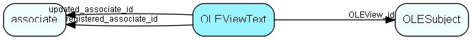

# OLEViewText Table (164)

Control data table for the OLE DB Provider

## Fields

| Name | Description | Type | Null |
|------|-------------|------|:----:|
|OLEViewText\_id|Primary key|PK| |
|OLEView\_id|OLE View|FK [OLESubject](olesubject.md)| |
|languageId|LCID (see locale help) of language|Id| |
|name|OLE View name|String(29)| |
|description|View name as shown in Reporter studio.|String(99)|&#x25CF;|
|registered|Registered when|UtcDateTime| |
|registered\_associate\_id|Registered by whom|FK [associate](associate.md)| |
|updated|Last updated when|UtcDateTime| |
|updated\_associate\_id|Last updated by whom|FK [associate](associate.md)| |
|updatedCount|Number of updates made to this record|UShort| |

[!include[details](./includes/oleviewtext.md)]

## Indexes

| Fields | Types | Description |
|--------|-------|-------------|
|OLEViewText\_id |PK |Clustered, Unique |
|OLEView\_id |FK |Index |
|languageId |Id |Index |
|name |String(29) |Index |
|OLEView\_id, languageId |FK, Id |Index |

## Relationships

| Table|  Description |
|------|-------------|
|[associate](associate.md)  |Employees, resources and other users - except for External persons |
|[OLESubject](olesubject.md)  |Control data table for the OLE DB Provider |

## Replication Flags

* Replicate changes DOWN from central to satellites and travellers.
* Replicate changes UP from satellites and travellers back to central.
* Copy to satellite and travel prototypes.

## Security Flags

* No access control via user's Role.

