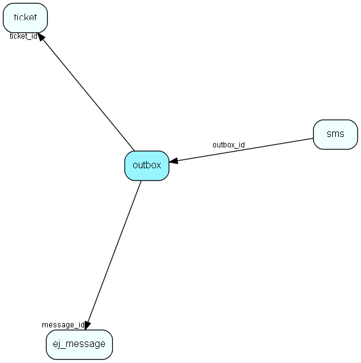

# outbox Table (351)

Outgoing emails with sending status and other info

## Fields

| Name | Description | Type | Null |
|------|-------------|------|:----:|
|id|Primary key|PK| |
|ticket\_id|The ticket.id this reference is connected to.|FK [ticket](ticket.md)|&#x25CF;|
|message\_id|The message.id this reference is connected to.|FK [ej_message](ej-message.md)|&#x25CF;|
|subject|Subject of the mail|String(255)| |
|from\_email|Mail address of the sender|String(255)| |
|from\_envelope|Envelope (smtp) Mail address of the sender|String(255)| |
|rcpt|A list of recipience|Clob|&#x25CF;|
|mail\_size|The size of the mail in bytes|Int| |
|created|When the mail was created|DateTime|&#x25CF;|
|status|Status enum|Int| |
|retries|The number of times we have tried to send this mail|Int| |
|next\_retry|When is the next time we should try again?|DateTime|&#x25CF;|
|pid|The process id owning this message|Int| |
|last\_error|The last error reported when sending this message|String(255)|&#x25CF;|
|type|Indicates if this is a SMS to be sent via WebServices or a normal email. 0 = email, 1 = sms|type| |
|rfc822\_content|The content of the outgoing email as a string. Alternative to using outbox file|Clob|&#x25CF;|

[!include[details](./includes/outbox.md)]

## Indexes

| Fields | Types | Description |
|--------|-------|-------------|
|id |PK |Clustered, Unique |
|ticket\_id |FK |Index |
|message\_id |FK |Index |

## Relationships

| Table|  Description |
|------|-------------|
|[ej\_message](ej-message.md)  |This table contains the messages listed under tickets. |
|[sms](sms.md)  |This table will hold outgoing sms messages when transmitted with WebServices |
|[ticket](ticket.md)  |This table contains the tickets (requests) of the system. Its purpose should be evident. |

## Replication Flags

* None

## Security Flags

* No access control via user's Role.

