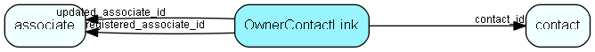

# OwnerContactLink Table (167)

Table specifying which contacts can own associates.  All contacts that have rows in this table (i.e. rows with contact_id pointing to them) will be offered as associate owners in the maintenance client and as candidate Satellite owners. Such contacts have restrictions on editing and deletion to protect database consistency. 

## Fields

| Name | Description | Type | Null |
|------|-------------|------|:----:|
|OwnerContactLink\_id|Primary key|PK| |
|contact\_id|Contact reference|FK [contact](contact.md)| |
|remark|Comment text|String(254)|&#x25CF;|
|registered|Registered when|UtcDateTime| |
|registered\_associate\_id|Registered by whom|FK [associate](associate.md)| |
|updated|Last updated when|UtcDateTime| |
|updated\_associate\_id|Last updated by whom|FK [associate](associate.md)| |
|updatedCount|Number of updates made to this record|UShort| |

[!include[details](./includes/ownercontactlink.md)]

## Indexes

| Fields | Types | Description |
|--------|-------|-------------|
|OwnerContactLink\_id |PK |Clustered, Unique |
|contact\_id |FK |Index |

## Relationships

| Table|  Description |
|------|-------------|
|[associate](associate.md)  |Employees, resources and other users - except for External persons |
|[contact](contact.md)  |Companies and Organizations.   This table features a special record containing information about the contact that owns the database.   |

## Replication Flags

* Replicate changes DOWN from central to satellites and travellers.
* Replicate changes UP from satellites and travellers back to central.
* Copy to satellite and travel prototypes.

## Security Flags

* No access control via user's Role.

