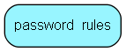

# password\_rules Table (322)

This table may contain one entry specifying rules for passwords.

## Fields

| Name | Description | Type | Null |
|------|-------------|------|:----:|
|id|The primary key (auto-incremented)|PK| |
|flags|Bitmask for flags|Int|&#x25CF;|
|min\_characters|The minimum number of characters in the password in order to be valid.|Int|&#x25CF;|
|min\_numbers|The minimum number of numbers in the password in order to be valid.|Int|&#x25CF;|
|min\_lowercase|The minimum number of lowercase characters in the password in order to be valid.|Int|&#x25CF;|
|min\_uppercase|The minimum number of uppercase characters in the password in order to be valid.|Int|&#x25CF;|
|min\_special|The minimum number of special characters in the password in order to be valid.|Int|&#x25CF;|

[!include[details](./includes/password-rules.md)]

## Indexes

| Fields | Types | Description |
|--------|-------|-------------|
|id |PK |Clustered, Unique |

## Replication Flags

* None

## Security Flags

* No access control via user's Role.

