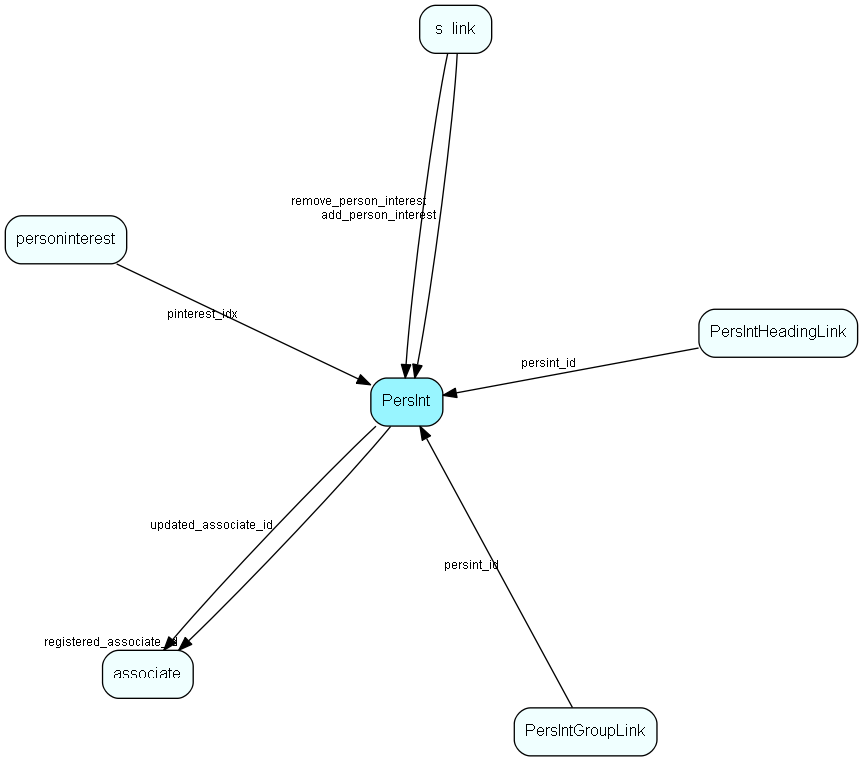

# PersInt Table (73)

PersInt MDO list item table.
PersInt list table. List of Person interests.

## Fields

| Name | Description | Type | Null |
|------|-------------|------|:----:|
|PersInt\_id|Primary key|PK| |
|name|The list item|String(239)| |
|rank|Rank order|UShort|&#x25CF;|
|tooltip|Tooltip or other description|String(254)|&#x25CF;|
|deleted|0 -&gt; record is active 1 -&gt; record is &apos;deleted&apos; and should not be shown in lists|UShort|&#x25CF;|
|registered|Registered when|UtcDateTime| |
|registered\_associate\_id|Registered by whom|FK [associate](associate.md)| |
|updated|Last updated when|UtcDateTime| |
|updated\_associate\_id|Last updated by whom|FK [associate](associate.md)| |
|updatedCount|Number of updates made to this record|UShort| |

[!include[details](./includes/persint.md)]

## Indexes

| Fields | Types | Description |
|--------|-------|-------------|
|PersInt\_id |PK |Clustered, Unique |
|name |String(239) |Unique |

## Relationships

| Table|  Description |
|------|-------------|
|[associate](associate.md)  |Employees, resources and other users - except for External persons |
|[PersIntGroupLink](persintgrouplink.md)  |User group link table for PersInt, for MDO item hiding |
|[PersIntHeadingLink](persintheadinglink.md)  |Heading link table for PersInt, for MDO headers |
|[personinterest](personinterest.md)  |Note: If you add or remove rows in this table, you will need to update the interestCount field in the person table accordingly. This field should always reflect the number of interest records a person has, to enable the correct setting of the interest indicator on the tab in the person dialog.  Replication note: The combination of person_id and pinterest_idx is unique. If a duplicate is made on a replicated database, the system will replace the record in the target database with the one derived from the source database during replication. Therefore, do not assume that a record in this table will retain its ID indefinitely, even if the person keeps the interest. |
|[s\_link](s-link.md)  |Links in messages to measure success rate of a campaign. |

## Replication Flags

* Replicate changes DOWN from central to satellites and travellers.
* Replicate changes UP from satellites and travellers back to central.
* Copy to satellite and travel prototypes.

## Security Flags

* No access control via user's Role.

