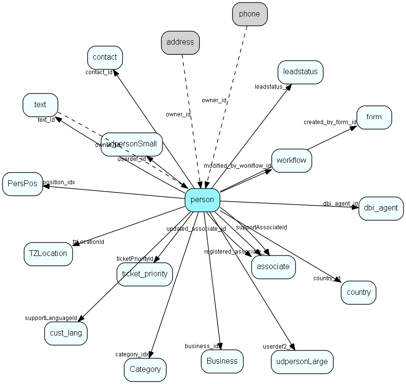

# person Table (6)

Persons in a company or an organizations. All associates have a corresponding person record

## Fields

| Name | Description | Type | Null |
|------|-------------|------|:----:|
|person\_id|Primary key|PK| |
|contact\_id|Owning contact ID|FK [contact](contact.md)| |
|rank|Display sort sequence for default sort order|UShort| |
|lastname|Last name|String(99)|&#x25CF;|
|firstname|First name|String(99)| |
|mrmrs|e.g. Mrs   sex_title|String(239)|&#x25CF;|
|title|Title|String(239)|&#x25CF;|
|text\_id|Info tab contents|FK [text](text.md)|&#x25CF;|
|position\_idx|Link to Position list|FK [PersPos](perspos.md)|&#x25CF;|
|year\_of\_birth|Birth year (4 digit), 0 if not specifed|UShort|&#x25CF;|
|month\_of\_birth|Birth month (1-12), 0 if not specified|UShort|&#x25CF;|
|day\_of\_birth|Birth date (day of month), 0 if not specified|UShort|&#x25CF;|
|phone\_present|flag to show there are phone registrations |UShort|&#x25CF;|
|userdef\_id|User defined table record 1|FK [udpersonSmall](udpersonsmall.md)|&#x25CF;|
|registered|Registered date|UtcDateTime| |
|registered\_associate\_id|Registered by whom|FK [associate](associate.md)| |
|updated|Last updated date|UtcDateTime| |
|updated\_associate\_id|Last updated by whom|FK [associate](associate.md)| |
|person\_number|Alphanumeric user field|String(49)|&#x25CF;|
|kanalname|Kana last name, used in Japanese versions only|String(99)|&#x25CF;|
|kanafname|Kana last name, used in Japanese versions only|String(99)|&#x25CF;|
|post1|Postal address, used in Japanese versions only|String(99)|&#x25CF;|
|post2|Postal address, used in Japanese versions only|String(99)|&#x25CF;|
|post3|Postal address, used in Japanese versions only|String(99)|&#x25CF;|
|usepersonaddress|If 1, use person&apos;s address for mailing instead of company address|UShort|&#x25CF;|
|middleName|Middle name or &apos;van&apos; etc.|String(99)|&#x25CF;|
|source|How did we get this person? For future integration needs|UShort|&#x25CF;|
|nomailing|Do not send DM&apos;s to this person|Bool|&#x25CF;|
|country\_id|Country|FK [country](country.md)| |
|userdef2\_id|User defined table record 2|FK [udpersonLarge](udpersonlarge.md)|&#x25CF;|
|retired|1 = the user is retired and should have no rights, not appear in lists, etc.|UShort|&#x25CF;|
|activeInterests|Number of records in pintr table; select count(*) from pintr pi where pi.person_id = this.person_id == activeInterests is always true|UShort|&#x25CF;|
|updatedCount|Number of times updated|UShort| |
|associate\_id|Our contact, if this is a B2C person, otherwise mirror of contact.assoc_id|Id|&#x25CF;|
|group\_id|Our contact&apos;s original group, if this is a B2C person, otherwise mirror of contact.group_id|Id|&#x25CF;|
|salutation|Academic title, populated from Salutation list but can be overwritten with anything at all|String(239)|&#x25CF;|
|department|Internal department address|String(254)|&#x25CF;|
|initials|Where Pierre van Mever becomes P. van Mever.  Actually, initials to be used in formal addresses, mostly in the Ducth market|String(63)|&#x25CF;|
|gender|Male/female. No jokes please.  To be used for selecting correct salutations &amp; grammar. 0 = unknown, 1 = female, 2 = male|Enum [PersonGender](enums/persongender.md)|&#x25CF;|
|business\_idx|Business if this is a B2C person, otherwise mirror of contact.business_idx|FK [Business](business.md)| |
|category\_idx|Category if this is a B2C person, otherwise mirror of contact.category_idx|FK [Category](category.md)| |
|tzLocationId|Default timezone location for this person|FK [TZLocation](tzlocation.md)|&#x25CF;|
|sentInfo|Has information on username/password been sent (ejournal)|UShort|&#x25CF;|
|showContactTickets|Should tickets related to the company be shown to this person|UShort|&#x25CF;|
|ticketPriorityId|Default ticket priority for new tickets|FK [ticket_priority](ticket-priority.md)|&#x25CF;|
|supportLanguageId|Customers language (does not necessarily map to ISO languages)|FK [cust_lang](cust-lang.md)|&#x25CF;|
|supportAssociateId|Our contact, but for support context, not sales/primary contact|FK [associate](associate.md)|&#x25CF;|
|dbi\_agent\_id|Integration agent (eJournal)|FK [dbi_agent](dbi-agent.md)|&#x25CF;|
|dbi\_key|The primary key for the integrated entry in the external datasource.|String(255)|&#x25CF;|
|dbi\_last\_syncronized|Last external syncronization.|DateTime|&#x25CF;|
|dbi\_last\_modified|When the entry was last modified.|DateTime|&#x25CF;|
|blockEmarketing|Do not send E-marketing materials to this person|Bool|&#x25CF;|
|activeErpLinks|The number of Erp Sync connections this record is synced with; count of the ErpExternalKey+ErpInternalKey relations|Int|&#x25CF;|
|DeletedDate|Datetime (utc) when this record was soft-deleted; if this value is set then the record should not be shown|UtcDateTime|&#x25CF;|
|created\_by\_form\_id|The form this person was created by|FK [form](form.md)|&#x25CF;|
|modified\_by\_workflow\_id|The workflow this person last was modified by|FK [workflow](workflow.md)|&#x25CF;|
|modified\_by\_workflow\_when|When the workflow modified this person|UtcDateTime|&#x25CF;|

[!include[details](./includes/person.md)]

## Indexes

| Fields | Types | Description |
|--------|-------|-------------|
|person\_id |PK |Clustered, Unique |
|contact\_id |FK |Index |
|lastname |String(99) |Index |
|firstname |String(99) |Index |
|userdef\_id |FK |Index |
|person\_number |String(49) |Index |
|kanalname |String(99) |Index |
|kanafname |String(99) |Index |
|source |UShort |Index |
|userdef2\_id |FK |Index |
|business\_idx |FK |Index |
|category\_idx |FK |Index |
|dbi\_agent\_id |FK |Index |
|dbi\_key |String(255) |Index |
|dbi\_last\_syncronized |DateTime |Index |
|dbi\_last\_modified |DateTime |Index |
|contact\_id, rank |FK, UShort |Index |
|middleName |String(99) |Index |
|DeletedDate |UtcDateTime |Index |
|created\_by\_form\_id |FK |Index |
|modified\_by\_workflow\_id |FK |Index |

## Relationships

| Table|  Description |
|------|-------------|
|[address](address.md)  |Contact and Person addresses |
|[appointment](appointment.md)  |Tasks, appointments, followups, phone calls; and documents (document_id != 0). An appointment always has a corresponding record in VisibleFor specifying who may see this.  |
|[associate](associate.md)  |Employees, resources and other users - except for External persons |
|[Business](business.md)  |Business list table |
|[Category](category.md)  |Category list table |
|[chat\_session](chat-session.md)  |This table contains chat sessions. |
|[ConsentPerson](consentperson.md)  |Link table that defines who has which consents |
|[contact](contact.md)  |Companies and Organizations.   This table features a special record containing information about the contact that owns the database.   |
|[CounterValue](countervalue.md)  |Visible for rights |
|[country](country.md)  |Country information |
|[Credentials](credentials.md)  |Alternative credentials |
|[cust\_lang](cust-lang.md)  |This table contains entries for customer languages. |
|[dbi\_agent](dbi-agent.md)  |DBI agent settings |
|[ej\_message](ej-message.md)  |This table contains the messages listed under tickets. |
|[Email](email.md)  |Email addresses for contacts, projects and persons |
|[email\_item](email-item.md)  |Email data |
|[form](form.md)  |A form which can be published on a webpage and submitted by visitors |
|[form\_submission](form-submission.md)  |A form submission |
|[invoice](invoice.md)  |This table contains invoice entries, normally created when an invoice is sent to a customer, and we want to update the balance. |
|[invoice\_sum](invoice-sum.md)  |This table is used temporarily when listing invoice statistics. It is used because we need to sort balances from both customers and companies. |
|[kb\_entry\_comment](kb-entry-comment.md)  |Comments to entries in the knowledge base, typically made by customers |
|[login\_customer](login-customer.md)  |This table contains entries for customer sessions. At first only used for Soap logins, but will later also be used for web logins |
|[message\_customers](message-customers.md)  |This table contains all cutomers who are involved in a message |
|[personinterest](personinterest.md)  |Note: If you add or remove rows in this table, you will need to update the interestCount field in the person table accordingly. This field should always reflect the number of interest records a person has, to enable the correct setting of the interest indicator on the tab in the person dialog.  Replication note: The combination of person_id and pinterest_idx is unique. If a duplicate is made on a replicated database, the system will replace the record in the target database with the one derived from the source database during replication. Therefore, do not assume that a record in this table will retain its ID indefinitely, even if the person keeps the interest. |
|[PersPos](perspos.md)  |PersPos list table. Contact person position list |
|[phone](phone.md)  |Contact and Person phonenumbers (+fax) |
|[projectmember](projectmember.md)  |Project members. Link-table between person and project |
|[s\_bounce\_shipment](s-bounce-shipment.md)  |Email bounces from customers |
|[s\_link\_customer](s-link-customer.md)  |A connection between a customer and a link. Registered customers are identified when clicking on a link |
|[s\_list\_customer](s-list-customer.md)  |Elements in a customer list. |
|[s\_sent\_message](s-sent-message.md)  |Emarketeer message control |
|[s\_shipment\_addr](s-shipment-addr.md)  |Addresses that are ready to be sent in a shipment. |
|[sale](sale.md)  |Sales  For every Sale record edited through the SuperOffice GUI, a copy of the current version of the record will be saved in the SaleHist table. This also applies to editing done through the SaleModel COM interface, but not to editing done through the OLE DB Provider or other channels.   |
|[SaleHist](salehist.md)  |Mirror image of the Sale table, providing a full transaction history. Every time you edit a sale, the current record of the sale is also saved here.  |
|[SaleStakeholder](salestakeholder.md)  |Stakeholders in the sale, very similar to project members |
|[selectionmember](selectionmember.md)  |Selection detail table  Each row in a selection is represented by one record in this table. Contact_id is always filled in, person_id is optional, but if used, must point to a person belonging to the contact in contact_id. |
|[ShipmentTypeReservation](shipmenttypereservation.md)  |ShipmentTypes a person has reserved against. Note that the absense of a record here implies acceptance of a mailings of this type |
|[sms](sms.md)  |This table will hold outgoing sms messages when transmitted with WebServices |
|[StatusValue](statusvalue.md)  |Values for statuses |
|[TemporaryKey](temporarykey.md)  |Temporary keys for lightweight authentications such as changing ones subscriptions |
|[text](text.md)  |Long text fields from all over the system |
|[ticket](ticket.md)  |This table contains the tickets (requests) of the system. Its purpose should be evident. |
|[ticket\_customers](ticket-customers.md)  |This table allows several customers to be connected to several tickets (many-to-many) |
|[ticket\_log\_action](ticket-log-action.md)  |This table contains actions for the tickets. |
|[ticket\_priority](ticket-priority.md)  |This table contains the ticket priorities. |
|[TZLocation](tzlocation.md)  |Time zone location |
|[udpersonLarge](udpersonlarge.md)  |User-defined fields |
|[udpersonSmall](udpersonsmall.md)  |User-defined fields |
|[URL](url.md)  |Unified Resource Locators, URL to contacts, persons or projects. |
|[user\_candidate](user-candidate.md)  |This table will hold user candidate secrets |
|[workflow](workflow.md)  |SuperOffice specific info about a workflow |
|[workflow\_instance](workflow-instance.md)  |A set of properties related to the workflow instance of one participant going through the flow |

## Replication Flags

* Area Management controlled table. Contents replicated to satellites and traveller databases.
* Replicate changes UP from satellites and travellers back to central.
* Copy to satellite and travel prototypes.
* Cache table during filtering.

## Security Flags

* Sentry controls access to items in this table using user's Role and data rights matrix.

