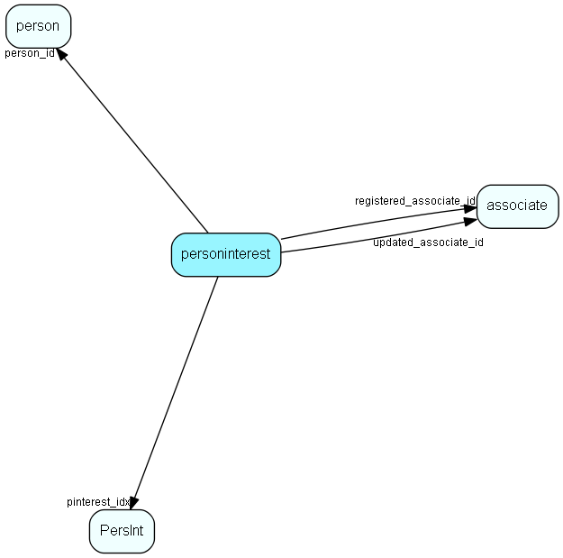

# personinterest Table (15)

Note; If you add or remove rows in this table, you will need to update the interestCount field in the person table accordingly. This field should always reflect the number of interest records a person has, to enable the correct setting of the interest indicator on the tab in the person dialog.  Replication note; The combination of person_id and pinterest_idx is unique. If a duplicate is made on a replicated database, the system will replace the record in the target database with the one derived from the source database during replication. Therefore, do not assume that a record in this table will retain its ID indefinitely, even if the person keeps the interest.

## Fields

| Name | Description | Type | Null |
|------|-------------|------|:----:|
|personinterest\_id|Primary key|PK| |
|person\_id|Owning person|FK [person](person.md)| |
|pinterest\_idx|Person interest link|FK [PersInt](persint.md)| |
|startDate|Start date for this interest - no GUI|DateTime|&#x25CF;|
|endDate|End date for this interest - no GUI|DateTime|&#x25CF;|
|flags|Spare flag field|UInt|&#x25CF;|
|registered|Registered when|UtcDateTime| |
|registered\_associate\_id|Registered by whom|FK [associate](associate.md)| |
|updated|Last updated when|UtcDateTime| |
|updated\_associate\_id|Last updated by whom|FK [associate](associate.md)| |
|updatedCount|Number of updates made to this record|UShort| |

[!include[details](./includes/personinterest.md)]

## Indexes

| Fields | Types | Description |
|--------|-------|-------------|
|personinterest\_id |PK |Unique |
|pinterest\_idx |FK |Index |
|startDate |DateTime |Index |
|endDate |DateTime |Index |
|person\_id, pinterest\_idx |FK, FK |Unique |
|person\_id |FK |Clustered |

## Relationships

| Table|  Description |
|------|-------------|
|[associate](associate.md)  |Employees, resources and other users - except for External persons |
|[PersInt](persint.md)  |PersInt list table. List of Person interests. |
|[person](person.md)  |Persons in a company or an organizations. All associates have a corresponding person record |

## Replication Flags

* Area Management controlled table. Contents replicated to satellites and traveller databases.
* Replicate changes UP from satellites and travellers back to central.
* Copy to satellite and travel prototypes.

## Security Flags

* Sentry controls access to items in this table using user's Role and data rights matrix on the table's parent.

