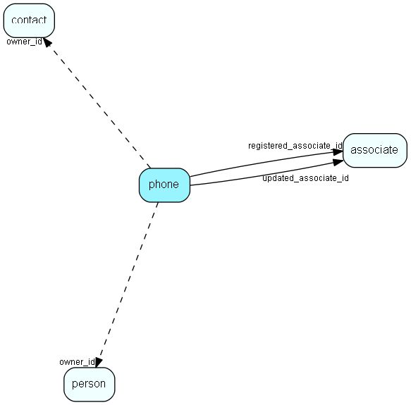

# phone Table (8)

Contact and Person phonenumbers (+fax)

## Fields

| Name | Description | Type | Null |
|------|-------------|------|:----:|
|phone\_id|Primary key|PK| |
|owner\_id|Record id of owner: Contact or Person|Id| |
|ptype\_idx|Bit mask, combines phone type (EPhoneType) and owner type (EOwnerType)|Enum [PhoneType](enums/phonetype.md)| |
|phone|Actual phone number as enterd by the user|String(239)| |
|rank|Sort order|UShort|&#x25CF;|
|description|Visible description|String(99)|&#x25CF;|
|registered|Registered when|UtcDateTime| |
|registered\_associate\_id|Registered by whom|FK [associate](associate.md)| |
|updated|Last updated when|UtcDateTime| |
|updated\_associate\_id|Last updated by whom|FK [associate](associate.md)| |
|updatedCount|Number of updates made to this record|UShort| |
|validFrom|Valid from date for this record|DateTime|&#x25CF;|
|validTo|Valid to date for this record|DateTime|&#x25CF;|
|searchPhoneNumber|Stripped phone number for searching, takes over for search_phone|String(239)|&#x25CF;|

[!include[details](./includes/phone.md)]

## Indexes

| Fields | Types | Description |
|--------|-------|-------------|
|phone\_id |PK |Clustered, Unique |
|rank |UShort |Index |
|owner\_id, ptype\_idx |Id, Enum |Index |
|searchPhoneNumber |String(239) |Index |

## Relationships

| Table|  Description |
|------|-------------|
|[associate](associate.md)  |Employees, resources and other users - except for External persons |
|[contact](contact.md)  |Companies and Organizations.   This table features a special record containing information about the contact that owns the database.   |
|[person](person.md)  |Persons in a company or an organizations. All associates have a corresponding person record |

## Replication Flags

* Area Management controlled table. Contents replicated to satellites and traveller databases.
* Replicate changes UP from satellites and travellers back to central.
* Copy to satellite and travel prototypes.

## Security Flags

* Sentry controls access to items in this table using user's Role and data rights matrix on the table's parent.

