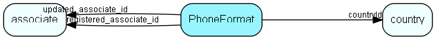

# PhoneFormat Table (251)

Formatting information for telephone numbers

## Fields

| Name | Description | Type | Null |
|------|-------------|------|:----:|
|PhoneFormat\_id|Primary key|PK| |
|countryId|Country this format record is valid for|FK [country](country.md)| |
|prefix|Prefix that triggers this format|String(39)| |
|dontFormat|If 1, do not apply any formatting to this number|Bool| |
|areaCodeLength|Length of area code (can be interval)|String(39)| |
|localLength|Length of local part of telephone number (can be interval)|String(39)| |
|mask|Formatting mask to be applied|String(39)| |
|description|Description of this format|String(254)| |
|isBuiltIn|Does this row come from SuperOffice priming data|Bool| |
|isActive|Is this format record active (handy for experimenting)|Bool|&#x25CF;|
|registered|Registered when|UtcDateTime| |
|registered\_associate\_id|Registered by whom|FK [associate](associate.md)| |
|updated|Last updated when|UtcDateTime| |
|updated\_associate\_id|Last updated by whom|FK [associate](associate.md)| |
|updatedCount|Number of updates made to this record|UShort| |

[!include[details](./includes/phoneformat.md)]

## Indexes

| Fields | Types | Description |
|--------|-------|-------------|
|PhoneFormat\_id |PK |Clustered, Unique |
|prefix, countryId |String(39), FK |Unique |

## Relationships

| Table|  Description |
|------|-------------|
|[associate](associate.md)  |Employees, resources and other users - except for External persons |
|[country](country.md)  |Country information |

## Replication Flags

* Replicate changes DOWN from central to satellites and travellers.
* Replicate changes UP from satellites and travellers back to central.
* Copy to satellite and travel prototypes.

## Security Flags

* No access control via user's Role.

