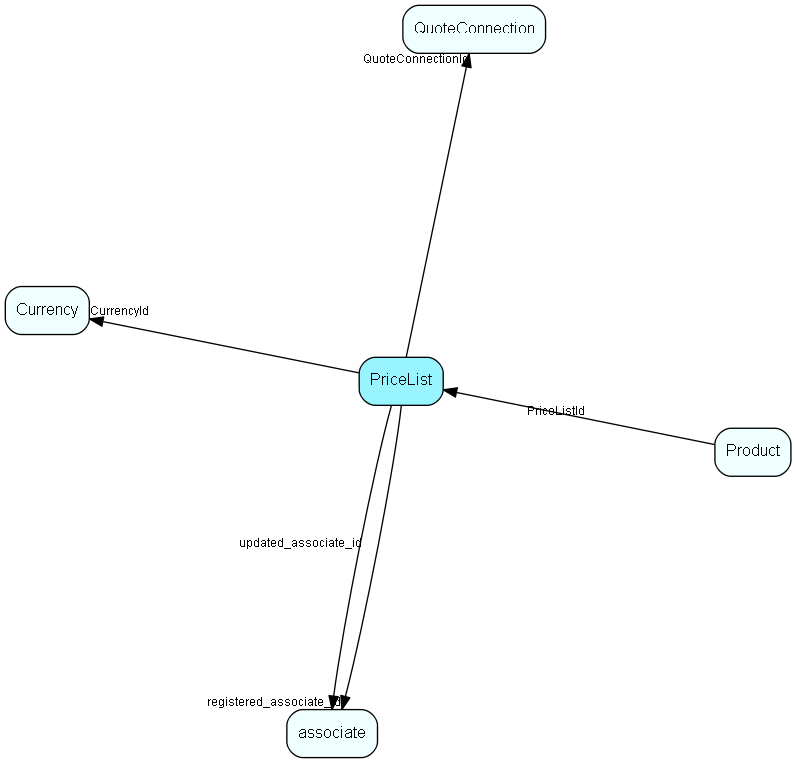

# PriceList Table (128)

List of prices, cached from an ERP system

## Fields

| Name | Description | Type | Null |
|------|-------------|------|:----:|
|pricelist\_id|Primary key|PK| |
|ERPPriceListKey|The key that uniquely identifies this pricelist in the ERP system|String(254)|&#x25CF;|
|QuoteConnectionId|(Reserved for future use) The connection to the ERP system used for this pricelist|FK [QuoteConnection](quoteconnection.md)|&#x25CF;|
|Name|Name of this pricelist to use in the user interface.|String(254)|&#x25CF;|
|Description|Description of this pricelist , will be used as tool-tip in the user interface.|String(254)|&#x25CF;|
|CurrencyId|What is the currency for this pricelist|FK [Currency](currency.md)|&#x25CF;|
|ValidFrom|The date (inclusive) the pricelist start to be valid. This can be DateTime.MinValue to signal that it doesn&apos;t have a specific start date.|DateTime|&#x25CF;|
|ValidTo|The date (inclusive) the pricelist ends to be valid. This can be DateTime.MaxValue to signal that it doesn&apos;t have a specific end date.|DateTime|&#x25CF;|
|IsActive|Is the list active (as opposed to being worked on, suddenly canceled, etc.|Bool|&#x25CF;|
|IsERPCopy|If true, then this pricelist is a cache/copy and cannot be edited by users in CRM|Bool|&#x25CF;|
|registered|Registered when|UtcDateTime| |
|registered\_associate\_id|Registered by whom|FK [associate](associate.md)| |
|updated|Last updated when|UtcDateTime| |
|updated\_associate\_id|Last updated by whom|FK [associate](associate.md)| |
|updatedCount|Number of updates made to this record|UShort| |

[!include[details](./includes/pricelist.md)]

## Indexes

| Fields | Types | Description |
|--------|-------|-------------|
|pricelist\_id |PK |Clustered, Unique |
|CurrencyId |FK |Index |
|ValidFrom, ValidTo, IsActive, IsERPCopy |DateTime, DateTime, Bool, Bool |Index |

## Relationships

| Table|  Description |
|------|-------------|
|[associate](associate.md)  |Employees, resources and other users - except for External persons |
|[Currency](currency.md)  |Currency list table |
|[Product](product.md)  |One Product, member of one price list |
|[QuoteConnection](quoteconnection.md)  |Primary key in the CRM database. Definition of a connection to an external system, for the Quote system. |

## Replication Flags

* Replicate changes DOWN from central to satellites and travellers.
* Copy to satellite and travel prototypes.

## Security Flags

* No access control via user's Role.

