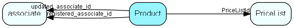

# Product Table (129)

One Product, member of one price list

## Fields

| Name | Description | Type | Null |
|------|-------------|------|:----:|
|product\_id|Primary key|PK| |
|ERPProductKey|Reference/foreign key to the product in the given pricelist in the product supplier system, if it exists there.|String(254)|&#x25CF;|
|PriceListId|Foreign key to the price list that this product is a part of.|FK [PriceList](pricelist.md)|&#x25CF;|
|Name|The name to use in the user interface.|String(254)|&#x25CF;|
|Description|The description to use, with potentially several lines. Will be used as tool-tip to use in the list user interface too.|String(2047)|&#x25CF;|
|Code|The product code / article number in the product supplier system.|String(254)|&#x25CF;|
|QuantityUnit|What is the unit (meter, ton, bushel, microsecond, gradus, τρυβλίον, 五合枡, دونم or whatever); Connector handles conversion relative to PriceUnit if they are different|String(79)|&#x25CF;|
|PriceUnit|What is the unit (meter, ton, bushel, microsecond, gradus, τρυβλίον, 五合枡, دونم or whatever); read-only for lines that originate in defined products|String(79)|&#x25CF;|
|IsSubscription|Is this a subscription product, sold in repeating intervals/amounts?|Bool|&#x25CF;|
|SubscriptionUnit|Either a List id to an id from a connector provided list, or, if the connection doesn’t support lists, a text with the actual subscription unit.|String(254)|&#x25CF;|
|DefaultSubscriptionQuantity|The default number of SubscriptionUnits to suggest when creating quote lines from this product|Double|&#x25CF;|
|ItemNumber|Line item number, NOR: «Postnummer». Specific numbers from some hierarchy, for instance “1.4.3.2P”. Typically used to sort the items in the quote by some standard way.|String(79)|&#x25CF;|
|Url|URL to product information web page.|String(1023)|&#x25CF;|
|ProductCategoryKey|Either a List id to an id from a connector provided list, or, if the connection doesn’t support lists, a text with the actual product category.|String(254)|&#x25CF;|
|ProductFamilyKey|Either a List id to an id from a connector provided list, or, if the connection doesn&apos;t support lists, a text with the actual product family.|String(254)|&#x25CF;|
|ProductTypeKey|Either a List id to an id from a connector provided list, or, if the connection doesn’t support lists, a text with the actual product type.|String(254)|&#x25CF;|
|VATInfo|A field for putting VATInfo you need to show in the final quoteDocument, like the VAT type that is used. Not used in any business logic in SuperOffice; available to document templates.|String(254)|&#x25CF;|
|VAT|Tax/VAT if available from ERP system. THIS IS A PERCENTAGE. In the Superoffice product register, this field is available in the product admin GUI.|Double|&#x25CF;|
|UnitCost|The cost price. Might not be given, use Decimal.MinValue to signal this.|Double|&#x25CF;|
|UnitMinimumPrice|The minimum price this salesman can offer to his customer. This might be cost price if there is no policy. Might not be given, use Decimal.MinValue to signal this.|Double|&#x25CF;|
|UnitListPrice|(Basic Price, normal price, standard price.) This is the basic price from which the discount is computed from. The ListPrice will stay the same even when a larger amount is ordered.|Double|&#x25CF;|
|ExtraInfo|Extra data (fields with labels). Shall be shown in the quoteline dialog. Additional info that the ERP system would like to store and show in the user interface. Information placed here is shown in the GUI if the “provide-extra-data” capability is true. Different products can have different fields. It will not be possible to directly put info here into the quote document.|Clob|&#x25CF;|
|InAssortment|True for products that should currently be offered, false when the product is discontinued and should not ordinarily be offered. When false the product no longer appears in search results.|Bool|&#x25CF;|
|Supplier|In SuperOffice, an id from the contact table, when saved as an ERP cache, the name of the supplier|String(254)|&#x25CF;|
|SupplierCode|Suppliers part code/number or other key-like field|String(254)|&#x25CF;|
|Rights|Field1=right&amp;Field2=right, etc. of any fields that have non-standard field access rights. Rights can be one of: N (=None or Hidden), R (=Read-only), W (=Writeable), M (=Mandatory). The fields will mostly be from the Quoteline table, but some added fields that are conceptually part of the quoteline, like Image will also be possibly to set rights on. Will be used by SuperOffice to control the user interface when showing the record.|String(2047)|&#x25CF;|
|Rule|The names of one or more calculation rules that are in effect for this line, comma-separated case-insensitive. Will NOT be used by SuperOffice.|String(254)|&#x25CF;|
|extraField1|This a simple field for adding information that the Connector can provide, and that the qoute document need to display.|String(1023)|&#x25CF;|
|extraField2|This a simple field for adding information that the Connector can provide, and that the qoute document need to display.|String(1023)|&#x25CF;|
|extraField3|This a simple field for adding information that the Connector can provide, and that the qoute document need to display.|String(1023)|&#x25CF;|
|extraField4|This a simple field for adding information that the Connector can provide, and that the qoute document need to display.|String(1023)|&#x25CF;|
|extraField5|This a simple field for adding information that the Connector can provide, and that the qoute document need to display.|String(1023)|&#x25CF;|
|registered|Registered when|UtcDateTime| |
|registered\_associate\_id|Registered by whom|FK [associate](associate.md)| |
|updated|Last updated when|UtcDateTime| |
|updated\_associate\_id|Last updated by whom|FK [associate](associate.md)| |
|updatedCount|Number of updates made to this record|UShort| |

[!include[details](./includes/product.md)]

## Indexes

| Fields | Types | Description |
|--------|-------|-------------|
|product\_id |PK |Clustered, Unique |
|ERPProductKey |String(254) |Index |
|PriceListId |FK |Index |

## Relationships

| Table|  Description |
|------|-------------|
|[associate](associate.md)  |Employees, resources and other users - except for External persons |
|[PriceList](pricelist.md)  |List of prices, cached from an ERP system |

## Replication Flags

* Replicate changes DOWN from central to satellites and travellers.
* Copy to satellite and travel prototypes.

## Security Flags

* No access control via user's Role.

