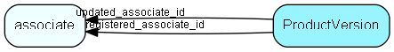

# ProductVersion Table (240)

Version information for code modules. Owner + code module must be unique

## Fields

| Name | Description | Type | Null |
|------|-------------|------|:----:|
|ProductVersion\_id|Primary key|PK| |
|ownerName|Owner of code module|String(254)| |
|codeName|The name of the code module, which is not the same as a license module|String(254)| |
|version|The version string, formatted as the code module would like to. Keybase will have to understand these strings if they are relevant to the licenses issued.|String(254)| |
|comment|Possible comment string added by code|String(254)| |
|updatePath|Path MSI or other files, that contain the installation for this version; used for auto-update|String(1023)|&#x25CF;|
|registered|Registered when|UtcDateTime| |
|registered\_associate\_id|Registered by whom|FK [associate](associate.md)| |
|updated|Last updated when|UtcDateTime| |
|updated\_associate\_id|Last updated by whom|FK [associate](associate.md)| |
|updatedCount|Number of updates made to this record|UShort| |

[!include[details](./includes/productversion.md)]

## Indexes

| Fields | Types | Description |
|--------|-------|-------------|
|ProductVersion\_id |PK |Clustered, Unique |
|ownerName, codeName, version |String(254), String(254), String(254) |Unique |

## Relationships

| Table|  Description |
|------|-------------|
|[associate](associate.md)  |Employees, resources and other users - except for External persons |

## Replication Flags

* None

## Security Flags

* No access control via user's Role.

