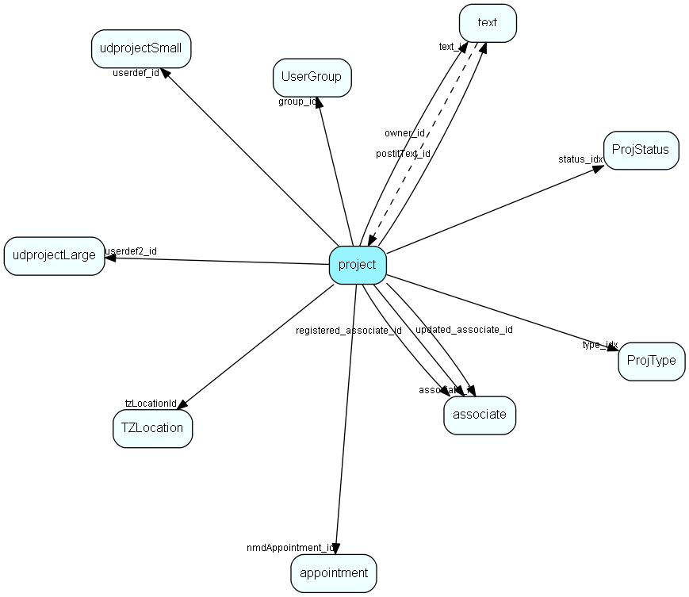

# project Table (11)

Projects

## Fields

| Name | Description | Type | Null |
|------|-------------|------|:----:|
|project\_id|Primary key|PK| |
|name|Project name|String(219)|&#x25CF;|
|project\_number|Automatically generated number|String(49)|&#x25CF;|
|type\_idx|Link to ProjType list|FK [ProjType](projtype.md)| |
|status\_idx|Link to ProjStatus list|FK [ProjStatus](projstatus.md)|&#x25CF;|
|associate\_id|Project manager/owner|FK [associate](associate.md)| |
|text\_id|Description field|FK [text](text.md)|&#x25CF;|
|registered|Registered date|UtcDateTime| |
|registered\_associate\_id|Registered by whom|FK [associate](associate.md)| |
|updated|Last updated date|UtcDateTime| |
|updated\_associate\_id|Last updated by whom|FK [associate](associate.md)| |
|userdef\_id|Pointer to userdef small table|FK [udprojectSmall](udprojectsmall.md)|&#x25CF;|
|soundEx|What the name sounds like, for duplicate detection|String(9)|&#x25CF;|
|source|How did we get this project? For future integration needs|UShort|&#x25CF;|
|userdef2\_id|User defined table record 2|FK [udprojectLarge](udprojectlarge.md)|&#x25CF;|
|postitText\_id|Paperclip text|FK [text](text.md)|&#x25CF;|
|updatedCount|Number of updates made to this record|UShort| |
|group\_id|Group id of original owning associate, semantics like appnt.grp_id|FK [UserGroup](usergroup.md)|&#x25CF;|
|tzLocationId|Default timezone location for this project|FK [TZLocation](tzlocation.md)|&#x25CF;|
|activeLinks|Number of active links to documents, other appointments, and such|UInt|&#x25CF;|
|done|Done (0=false, 1=true). Status implies changes in which fields are shown in GUI, as well as which fields can be updated|Bool|&#x25CF;|
|endDate|Planned end date for project, inhertied from type and later editable|DateTime|&#x25CF;|
|nextMilestoneDate|Calculated date, reflects date of closest non-complete future milestone activity|DateTime|&#x25CF;|
|nmdAppointment\_id|ID of appointment that &quot;caused&quot; the nextMilestoneDate, can be 0|FK [appointment](appointment.md)|&#x25CF;|
|activeErpLinks|The number of Erp Sync connections this record is synced with; count of the ErpExternalKey+ErpInternalKey relations|Int|&#x25CF;|

[!include[details](./includes/project.md)]

## Indexes

| Fields | Types | Description |
|--------|-------|-------------|
|project\_id |PK |Clustered, Unique |
|name |String(219) |Index |
|project\_number |String(49) |Index |
|soundEx |String(9) |Index |
|source |UShort |Index |
|userdef2\_id |FK |Index |
|done |Bool |Index |

## Relationships

| Table|  Description |
|------|-------------|
|[appointment](appointment.md)  |Tasks, appointments, followups, phone calls; and documents (document_id != 0). An appointment always has a corresponding record in VisibleFor specifying who may see this.  |
|[associate](associate.md)  |Employees, resources and other users - except for External persons |
|[chat\_session](chat-session.md)  |This table contains chat sessions. |
|[CounterValue](countervalue.md)  |Visible for rights |
|[Email](email.md)  |Email addresses for contacts, projects and persons |
|[projectmember](projectmember.md)  |Project members. Link-table between person and project |
|[ProjStatus](projstatus.md)  |ProjStatus list table. Project status |
|[ProjType](projtype.md)  |ProjType list table. List of valid Project types. |
|[s\_link](s-link.md)  |Links in messages to measure success rate of a campaign. |
|[s\_shipment](s-shipment.md)  |Contains info about one shipment. The addresses are stored in s_shipment_addr |
|[sale](sale.md)  |Sales  For every Sale record edited through the SuperOffice GUI, a copy of the current version of the record will be saved in the SaleHist table. This also applies to editing done through the SaleModel COM interface, but not to editing done through the OLE DB Provider or other channels.   |
|[SaleHist](salehist.md)  |Mirror image of the Sale table, providing a full transaction history. Every time you edit a sale, the current record of the sale is also saved here.  |
|[StatusValue](statusvalue.md)  |Values for statuses |
|[text](text.md)  |Long text fields from all over the system |
|[ticket](ticket.md)  |This table contains the tickets (requests) of the system. Its purpose should be evident. |
|[TZLocation](tzlocation.md)  |Time zone location |
|[udprojectLarge](udprojectlarge.md)  |User-defined fields. During conversion of user defined fields the data is stored in this table. |
|[udprojectSmall](udprojectsmall.md)  |User-defined fields |
|[URL](url.md)  |Unified Resource Locators, URL to contacts, persons or projects. |
|[UserGroup](usergroup.md)  |Secondary user groups |

## Replication Flags

* Area Management controlled table. Contents replicated to satellites and traveller databases.
* Replicate changes UP from satellites and travellers back to central.
* Copy to satellite and travel prototypes.
* Cache table during filtering.

## Security Flags

* Sentry controls access to items in this table using user's Role and data rights matrix.

