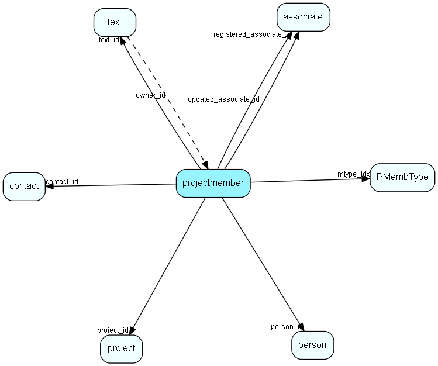

# projectmember Table (12)

Project members. Link-table between person and project

## Fields

| Name | Description | Type | Null |
|------|-------------|------|:----:|
|projectmember\_id|Primary key|PK| |
|project\_id|Parent project|FK [project](project.md)|&#x25CF;|
|contact\_id|Contact ID of person who is the project member (slight denormalization)|FK [contact](contact.md)|&#x25CF;|
|person\_id|Person ID of person who is the project member|FK [person](person.md)|&#x25CF;|
|rank|Rank in list|UShort|&#x25CF;|
|mtype\_idx|Member type link|FK [PMembType](pmembtype.md)|&#x25CF;|
|text\_id|Optional comment|FK [text](text.md)|&#x25CF;|
|registered|Registered when|UtcDateTime| |
|registered\_associate\_id|Registered by whom|FK [associate](associate.md)| |
|updated|Last updated when|UtcDateTime| |
|updated\_associate\_id|Last updated by whom|FK [associate](associate.md)| |
|updatedCount|Number of updates made to this record|UShort| |

[!include[details](./includes/projectmember.md)]

## Indexes

| Fields | Types | Description |
|--------|-------|-------------|
|projectmember\_id |PK |Clustered, Unique |
|contact\_id |FK |Index |
|person\_id |FK |Index |
|project\_id, rank |FK, UShort |Index |

## Relationships

| Table|  Description |
|------|-------------|
|[associate](associate.md)  |Employees, resources and other users - except for External persons |
|[contact](contact.md)  |Companies and Organizations.   This table features a special record containing information about the contact that owns the database.   |
|[person](person.md)  |Persons in a company or an organizations. All associates have a corresponding person record |
|[PMembType](pmembtype.md)  |PMembType list table. List text of titles (member types) for project members. |
|[project](project.md)  |Projects |
|[text](text.md)  |Long text fields from all over the system |

## Replication Flags

* Area Management controlled table. Contents replicated to satellites and traveller databases.
* Replicate changes UP from satellites and travellers back to central.
* Copy to satellite and travel prototypes.
* Cache table during filtering.

## Security Flags

* Sentry controls access to items in this table using user's Role and data rights matrix on the table's parent.

