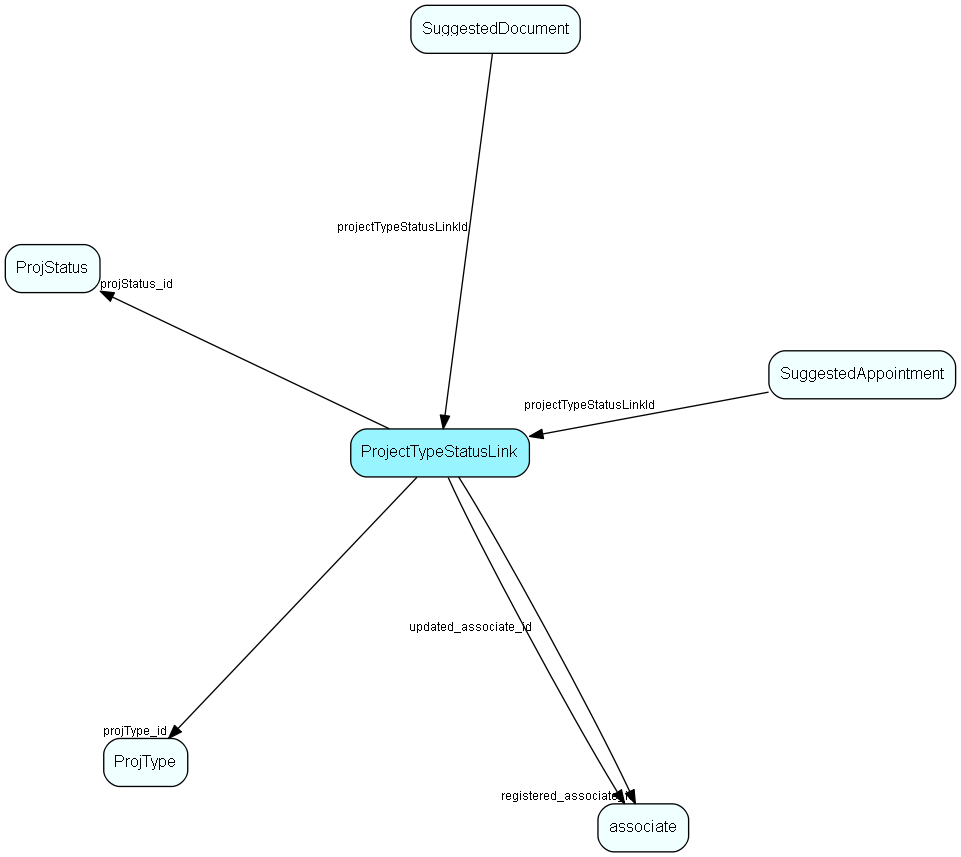

# ProjectTypeStatusLink Table (213)

Many-many link table between project type and status, similar to sale type-stage link; and an anchor point for guide items

## Fields

| Name | Description | Type | Null |
|------|-------------|------|:----:|
|ProjectTypeStatusLink\_id|Primary key|PK| |
|projType\_id|Link to project type|FK [ProjType](projtype.md)| |
|projStatus\_id|Link to project status|FK [ProjStatus](projstatus.md)| |
|rank|Rank order |UShort|&#x25CF;|
|deleted|0 -&gt; record is active 1 -&gt; record is &apos;deleted&apos; and should not be shown in lists|UShort|&#x25CF;|
|registered|Registered when|UtcDateTime| |
|registered\_associate\_id|Registered by whom|FK [associate](associate.md)| |
|updated|Last updated when|UtcDateTime| |
|updated\_associate\_id|Last updated by whom|FK [associate](associate.md)| |
|updatedCount|Number of updates made to this record|UShort| |

[!include[details](./includes/projecttypestatuslink.md)]

## Indexes

| Fields | Types | Description |
|--------|-------|-------------|
|ProjectTypeStatusLink\_id |PK |Clustered, Unique |
|projType\_id, projStatus\_id |FK, FK |Index |

## Relationships

| Table|  Description |
|------|-------------|
|[associate](associate.md)  |Employees, resources and other users - except for External persons |
|[ProjStatus](projstatus.md)  |ProjStatus list table. Project status |
|[ProjType](projtype.md)  |ProjType list table. List of valid Project types. |
|[SuggestedAppointment](suggestedappointment.md)  |Defines a suggested appointment for use in a Sale Guide or Project Guide |
|[SuggestedDocument](suggesteddocument.md)  |Unique owner of a set of licensed modules |

## Replication Flags

* Replicate changes DOWN from central to satellites and travellers.
* Replicate changes UP from satellites and travellers back to central.
* Copy to satellite and travel prototypes.

## Security Flags

* No access control via user's Role.

