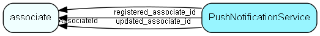

# PushNotificationService Table (496)

Used for storing handles to user devices that should receive push notifications

## Fields

| Name | Description | Type | Null |
|------|-------------|------|:----:|
|pushnotificationservice\_id|Primary key|PK| |
|AssociateId|To whom does this handle belong|FK [associate](associate.md)| |
|DeviceIdentifier|Unique device identifier|String(256)| |
|DeviceDisplayName|Userfriendly name for device. Ex: &apos;My iPhone 5S&apos;|String(256)|&#x25CF;|
|DevicePlatform|Device platform. Apple, Google, Microsoft, etc.|Enum [NotificationPlatform](enums/notificationplatform.md)| |
|PNSHandle|The platform specific handle needed for pushing messages directly to this device|String(1024)| |
|Tags|Comma separated list of notification types this device should or should not receive notifications about. Ex: &apos;invitations=0,meetings=1|String(3072)|&#x25CF;|
|PNSHandleUpdateDate|When was the PNSHandle for this device last updated|DateTime|&#x25CF;|
|LastNotificationDate|When was a notification last sent to this device|DateTime|&#x25CF;|
|TotalNotificationCount|How many notifications have been sent to this device|Int|&#x25CF;|
|registered|Registered when|UtcDateTime| |
|registered\_associate\_id|Registered by whom|FK [associate](associate.md)| |
|updated|Last updated when|UtcDateTime| |
|updated\_associate\_id|Last updated by whom|FK [associate](associate.md)| |
|updatedCount|Number of updates made to this record|UShort| |
|Language|The language to send translated messages in|String(256)|&#x25CF;|
|PocketVersion|The version of Pocket CRM this device is using|String(256)|&#x25CF;|
|OSVersion|The operating system version this device is using|String(256)|&#x25CF;|
|TimeZoneId|The timezone to show for dates in messages|Int|&#x25CF;|

[!include[details](./includes/pushnotificationservice.md)]

## Indexes

| Fields | Types | Description |
|--------|-------|-------------|
|pushnotificationservice\_id |PK |Clustered, Unique |

## Relationships

| Table|  Description |
|------|-------------|
|[associate](associate.md)  |Employees, resources and other users - except for External persons |

## Replication Flags

* None

## Security Flags

* No access control via user's Role.

