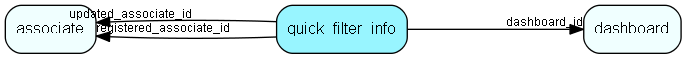

# quick\_filter\_info Table (487)

Connect quick filter info from a specific provider to a dashboard

## Fields

| Name | Description | Type | Null |
|------|-------------|------|:----:|
|quick\_filter\_info\_id|Primary key|PK| |
|dashboard\_id|What dashboard is this quickfilter for|FK [dashboard](dashboard.md)|&#x25CF;|
|provider\_name|The name of the provider|String(255)|&#x25CF;|
|registered|Registered when|UtcDateTime| |
|registered\_associate\_id|Registered by whom|FK [associate](associate.md)| |
|updated|Last updated when|UtcDateTime| |
|updated\_associate\_id|Last updated by whom|FK [associate](associate.md)| |
|updatedCount|Number of updates made to this record|UShort| |

[!include[details](./includes/quick-filter-info.md)]

## Indexes

| Fields | Types | Description |
|--------|-------|-------------|
|quick\_filter\_info\_id |PK |Clustered, Unique |
|dashboard\_id |FK |Index |

## Relationships

| Table|  Description |
|------|-------------|
|[associate](associate.md)  |Employees, resources and other users - except for External persons |
|[dashboard](dashboard.md)  |Describes a dashboard |

## Replication Flags

* None

## Security Flags

* No access control via user's Role.

