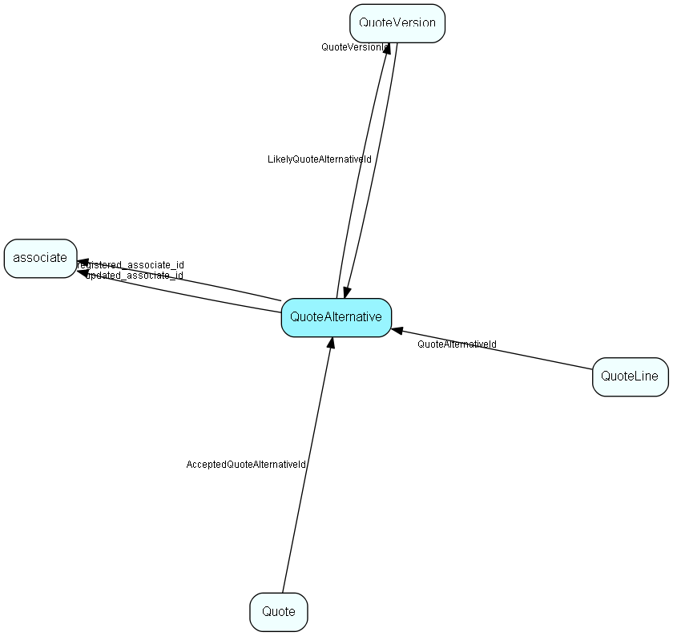

# QuoteAlternative Table (47)

Quote Version is made up of one or more Alternatives. One of 1..n possible alternatives in a Quote Version. The reason we have alternatives is that a quote can say to a customer, “we can solve you problem in two (or more) different ways, with different technology and sideeffects (and price)”. An Alternative may have discounts on the total amount. The Alternative tracks whether the user on the order level entered the Discount , Earning amount or the TotalPrice fields so that the discount and earning and total can be re-calculated correctly when Quote Lines are added or changed.

## Fields

| Name | Description | Type | Null |
|------|-------------|------|:----:|
|quotealternative\_id|Primary key|PK| |
|ERPQuoteAlternativeKey|Key that identifies this alternative in the ERP system, if it exists there.|String(254)|&#x25CF;|
|QuoteVersionId|The version that owns this alternative (the chain is Sale 1-&gt;1 Quote 1-&gt;+ QuoteVersion 1-&gt;+ QuoteAlternative.|FK [QuoteVersion](quoteversion.md)| |
|Name|Name of Alternative. Shown in tab in user interface, intentionally kept short|String(59)|&#x25CF;|
|Description|The tool-tip to use in the user interface (on the tab, for instance).|String(2047)|&#x25CF;|
|Status|If there was a problem with for instance calculation, this field is set to warning or error.|Enum [QuoteStatus](enums/quotestatus.md)|&#x25CF;|
|Reason|If there was a problem, this field contains a localized explanation of the problem and possible steps to fix it that the user can be shown.|String(2047)|&#x25CF;|
|ERPDiscountPercent|The discount the system calculates based on customer /amount / whatever. Can be overridden by the sales rep in the field ‘DiscountPercent’ or ‘DiscountAmount’. Both the two ‘ERPDiscountPercent’ and ‘ERPDiscountAmount’ shall be filled out. If UserValueOverride is &apos;None&apos;, then the ERPDiscountAmount shall be copied into DiscountAmount and ERPDiscountPercent into DiscountPercent. The Percentage is given in integer form, i.e. ‘12%’ is represented as ‘12’.|Double|&#x25CF;|
|ERPDiscountAmount|The discount the system calculates based on customer /amount / whatever. Can be overridden by the user in the field ‘DiscountPercent’ or ‘DiscountAmount’. Both the two ‘ERPDiscountPercent’ and ‘ERPDiscountAmount’ shall be filled out. If UserValueOverride is &apos;None&apos;, then the ERPDiscountAmount shall be copied into DiscountAmount and ERPDiscountPercent into DiscountPercent.|Double|&#x25CF;|
|DiscountPercent|The discount the sales rep specifies, in percent. Both the two ‘DiscountPercent’ and ‘DiscountAmount’ shall be filled out, but the UserValueOverride field must be set to the field the user actually changed. If this field is filled out by the user, it overrides the discount suggested by the connector. If the user has not filled any values, the system will copy the ERP discount percent value into this field. The Percentage is given in integer form, i.e. ‘12%’ is represented as ‘12’.|Double|&#x25CF;|
|DiscountAmount|The discount the sales rep specifies, in whatever currency the sale is in. Both the two ‘DiscountPercent’ and ‘DiscountAmount’ shall be filled out, but the UserValueOverride field must be set to the field the user actually changed. If this field is filled out by the user, it overrides the discount suggested by the connector. If the user has not filled any values, the system will copy the ERP discount amount value into this field.|Double|&#x25CF;|
|UserValueOverride|Has the pre-calculated (from ERP) price information been overridden, and how. If the user has filled out the discountpercentage field, then the UserValueOverride field is set to OverridePercent. (The DiscountAmount, EarningPercent, EarningAmount and TotalPrice fields are calculated based on the discountPercent.)|Enum [ValueOverride](enums/valueoverride.md)|&#x25CF;|
|VATInfo|Extra info about VAT that the connector might insert. This field has no business logic in the CRM code, but is available as a merge field in the quote documents.|String(254)|&#x25CF;|
|VAT|Tax/VAT - THIS IS AN AMOUNT, available as a merge field in the quote document. The SuperOffice quote connector will calculate this field based on the vat PERCENTAGES on the individual lines; other connectors may implement other algorithms at will.|Double|&#x25CF;|
|EarningPercent|The earning on this alternative, in percent of total. The Percentage is given in integer form, i.e. ‘12%’ is represented as ‘12’.|Double|&#x25CF;|
|EarningAmount|Earning on this alternative, as an absolute amount|Double|&#x25CF;|
|TotalPrice|Sum of the QuoteLines.TotalPrice - AlternativeDiscount or QuoteLines.TotalCost + Earning based on what, if anything, the user has entered last. Shall be calculated by the connector.|Double|&#x25CF;|
|extraField1|Optional information added by Quote Connector; usable in the quote document merge process|String(1023)|&#x25CF;|
|extraField2|Optional information added by Quote Connector; usable in the quote document merge process|String(1023)|&#x25CF;|
|extraField3|Optional information added by Quote Connector; usable in the quote document merge process|String(1023)|&#x25CF;|
|extraField4|Optional information added by Quote Connector; usable in the quote document merge process|String(1023)|&#x25CF;|
|extraField5|Optional information added by Quote Connector; usable in the quote document merge process|String(1023)|&#x25CF;|
|registered|Registered when|UtcDateTime| |
|registered\_associate\_id|Registered by whom|FK [associate](associate.md)| |
|updated|Last updated when|UtcDateTime| |
|updated\_associate\_id|Last updated by whom|FK [associate](associate.md)| |
|updatedCount|Number of updates made to this record|UShort| |

[!include[details](./includes/quotealternative.md)]

## Indexes

| Fields | Types | Description |
|--------|-------|-------------|
|quotealternative\_id |PK |Clustered, Unique |
|ERPQuoteAlternativeKey |String(254) |Index |
|QuoteVersionId |FK |Index |

## Relationships

| Table|  Description |
|------|-------------|
|[associate](associate.md)  |Employees, resources and other users - except for External persons |
|[Quote](quote.md)  |Quote root level, at most one per Sale, always connected to one Sale |
|[QuoteLine](quoteline.md)  |One line in a QuoteAlternative. QuoteLines are mainly information copied from the Products provider. Products information is sometimes edited by the user before being included in the quote, so most information is duplicated from Product rather than referenced directly. |
|[QuoteVersion](quoteversion.md)  |There may be multiple Versions of a Quote, with one of them active |

## Replication Flags

* Area Management controlled table. Contents replicated to satellites and traveller databases.
* Copy to satellite and travel prototypes.

## Security Flags

* Sentry controls access to items in this table using user's Role and data rights matrix.

