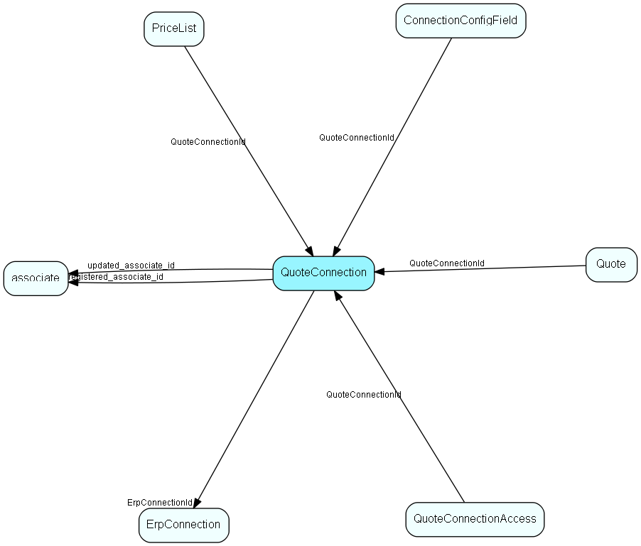

# QuoteConnection Table (26)

Primary key in the CRM database. Definition of a connection to an external system, for the Quote system.

## Fields

| Name | Description | Type | Null |
|------|-------------|------|:----:|
|quoteconnection\_id|Primary key|PK| |
|ERPName|Name of the ERP system (programmatic).|String(254)| |
|DisplayName|Connection name shown to user; multi-language support. The name of the connector to display in a list so that the users can choose between them. Typically the name of the client, with maybe the ERP system in parenthesis.|String(254)|&#x25CF;|
|DisplayDescription|Tooltip/description shown to user; multi-language support. Any other info available that would make an uncertain user chose the right connector. Typically, used for tooltip.|String(254)|&#x25CF;|
|Rank|Rank order |Int|&#x25CF;|
|ConnectorName|Programmatic name of the Connector plugin that implements this kind of connection|String(254)| |
|ExtraData|Optional extra data, in XML format, for configuring the connector. Connector-specific!|String(3999)|&#x25CF;|
|ErpConnectionId|The ERP Connection that this Quote connection is an extension of|FK [ErpConnection](erpconnection.md)|&#x25CF;|
|AllAccess|Is this connection accessible to everyone?  If not, then the QuoteConnectionAccess table tells us who can access it|Bool|&#x25CF;|
|Deleted|If set, then this is a row that has been &apos;deleted&apos;; we do not physically delete rows to avoid disaster|Bool|&#x25CF;|
|registered|Registered when|UtcDateTime| |
|registered\_associate\_id|Registered by whom|FK [associate](associate.md)| |
|updated|Last updated when|UtcDateTime| |
|updated\_associate\_id|Last updated by whom|FK [associate](associate.md)| |
|updatedCount|Number of updates made to this record|UShort| |

[!include[details](./includes/quoteconnection.md)]

## Indexes

| Fields | Types | Description |
|--------|-------|-------------|
|quoteconnection\_id |PK |Clustered, Unique |

## Relationships

| Table|  Description |
|------|-------------|
|[associate](associate.md)  |Employees, resources and other users - except for External persons |
|[ConnectionConfigField](connectionconfigfield.md)  |Configuration data for Erp and Quote Connections |
|[ErpConnection](erpconnection.md)  |One connection to an ERP connector, specifying Client and other required information |
|[PriceList](pricelist.md)  |List of prices, cached from an ERP system |
|[Quote](quote.md)  |Quote root level, at most one per Sale, always connected to one Sale |
|[QuoteConnectionAccess](quoteconnectionaccess.md)  |Access control for Quote Connections |

## Replication Flags

* Replicate changes DOWN from central to satellites and travellers.
* Copy to satellite and travel prototypes.

## Security Flags

* No access control via user's Role.

