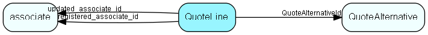

# QuoteLine Table (127)

One line in a QuoteAlternative. QuoteLines are mainly information copied from the Products provider. Products information is sometimes edited by the user before being included in the quote, so most information is duplicated from Product rather than referenced directly.

## Fields

| Name | Description | Type | Null |
|------|-------------|------|:----:|
|quoteline\_id|Primary key|PK| |
|ERPQuoteLineKey|The foreign key to the quoteline in ERP system (if it has such a representation).|String(254)|&#x25CF;|
|QuoteAlternativeId|The alternative this line is part of, the conceptual Parent in CRM database.|FK [QuoteAlternative](quotealternative.md)|&#x25CF;|
|ERPProductKey|Foreign key of product+pricelist this line is based on. Can be blank since the QuoteLine doesn’t have to be connected to a product.|String(254)|&#x25CF;|
|Status|If there was a problem with for instance calculation, this field is set to warning or error. Typically shown as an icon. QuoteStatus is an enum with statuses: OK, OKWithInfo, Warning, Error.|Enum [QuoteStatus](enums/quotestatus.md)|&#x25CF;|
|Reason|If QuoteStatus is not OK, then this field contains a localized explanation that the user can be shown.|String(2047)|&#x25CF;|
|Quantity|How many units; this is a decimal field since you might want to offer fractional units (2.5kg, or 0.5PC).|Double|&#x25CF;|
|DeliveredQuantity|How many units have been delivered - updated by ERP system.|Double|&#x25CF;|
|Rank|QuoteLines can be re-ordered, so we must track the ordering.|Int|&#x25CF;|
|Name|The name of the product. Is stored here if the user changes the value from the product in the pricelist, or just enters a QuoteLine without a product link.|String(254)|&#x25CF;|
|Description|A longer description for the product. Is stored here if the user changes the value from the product in the pricelist, or just enters a QuoteLine without a product link.|String(2047)|&#x25CF;|
|Code|A value the salesmen use to quickly find the correct product. Is stored here if the user changes the value from the product in the pricelist, or just enters a QuoteLine without a product link.|String(254)|&#x25CF;|
|QuantityUnit|What is the unit (meter, ton, bushel, microsecond, gradus, τρυβλίον, 五合枡, دونم or whatever); Connector handles conversion relative to PriceUnit if they are different.|String(79)|&#x25CF;|
|PriceUnit|What is the unit (meter, ton, bushel, microsecond, gradus, τρυβλίον, 五合枡, دونم or whatever); read-only for lines that originate in defined products.|String(79)|&#x25CF;|
|IsSubscription|Is this a subscription product, sold in repeating intervals/amounts?|Bool|&#x25CF;|
|SubscriptionUnit|Either a List id to an id from a connector provided list, or, if the connection doesn’t support lists, a text with the actual subscription unit.|String(254)|&#x25CF;|
|SubscriptionQuantity|The default number of SubscriptionUnits to suggest when creating quote lines from this product|Double|&#x25CF;|
|SubscriptionStart|Start date for subscription, as offered|DateTime|&#x25CF;|
|ItemNumber|Norwegian: «Postnummer». Specific numbers from some hierarchy, for instance &apos;1.4.3.2&apos;. Is stored here if the user changes the value from the product in the pricelist, or just enters a QuoteLine without a product link.|String(79)|&#x25CF;|
|Url|A url to the product info. Can be empty. Is stored here if the user changes the value from the product in the pricelist, or just enters a QuoteLine without a product link.|String(1023)|&#x25CF;|
|ProductCategoryKey|Either a List id to an id from a connector provided list, or, if the connection doesn&apos;t support lists, a text. Is stored here if the user changes the value from the product in the pricelist, or just enters a QuoteLine without a product link.|String(254)|&#x25CF;|
|ProductFamilyKey|Either a List id to an id from a connector provided list, or, if the connection doesn&apos;t support lists, a text. Is stored here if the user changes the value from the product in the pricelist, or just enters a QuoteLine without a product link.|String(254)|&#x25CF;|
|ProductTypeKey|Either a List id to an id from a connector provided list, or, if the connection doesn&apos;t support lists, a text. Is stored here if the user changes the value from the product in the pricelist, or just enters a QuoteLine without a product link.|String(254)|&#x25CF;|
|Supplier|The name of the supplier. Is stored here if the user changes the value from the product in the pricelist, or just enters a QuoteLine without a product link.|String(254)|&#x25CF;|
|SupplierCode|The suppliers&apos; code or part number for this product. Is stored here if the user changes the value from the product in the pricelist, or just enters a QuoteLine without a product link.|String(254)|&#x25CF;|
|VATInfo|Tax/VAT information, Extra info about VAT that the connector might insert, and the users might want to specify on the quote. The core CRM product has no business logic for this field, it is wholly up to connectors to use it.|String(254)|&#x25CF;|
|VAT|Tax/VAT - THIS IS A PERCENTAGE. The connector is responsible for populating this field; the percentage will be used to calculate VAT amounts available as merge fields in the document templates (but amounts are never stored in the database).|Double|&#x25CF;|
|UnitCost|The cost price per unit for this product. May be filled in by connector if it has the Provide-Cost capability.|Double|&#x25CF;|
|UnitMinimumPrice|The minimum price this line can be sold for (to limit discounting). Will come from the connector. List price per unit must exceed the minimum price per unit.|Double|&#x25CF;|
|UnitListPrice|The standard list price; as given by ERP Connector, OR overridden by user|Double|&#x25CF;|
|ExtraInfo|Extra information, supplied by QuoteConnector, used by a future dynamic GUI extension|Clob|&#x25CF;|
|ERPDiscountPercent|The discount the system calculates based on customer / quantity / whatever. Can be overrided by the salesman in the field &apos;DiscountPercent&apos; or &apos;DiscountAmount&apos;. Both fields ERPDiscountPercent and ERPDiscountAmount will be filled out. If UserValueOverride is set to ‘None’ then the value is copied to DiscountPercent. The Percentage is given in integer form, i.e. ‘12%’ is represented as ‘12’.|Double|&#x25CF;|
|ERPDiscountAmount|The discount the system calculates based on customer / quantity / whatever. Can be overrided by the salesman in the field &apos;DiscountPercent&apos; or &apos;DiscountAmount&apos;. If UserValueOverride is set to ‘None’ then the value is copied to DiscountAmount. Both fields ERPDiscountPercent and ERPDiscountAmount will be filled out.|Double|&#x25CF;|
|DiscountPercent|The discount for the line, in percent. Both ‘DiscountPercent’ and ‘DiscountAmount’ shall be filled out, but the UserValueOverride field must be set to the field the user actually changed last. If this field is filled out by the user, it overrides any discount suggested by the connector. If the user has not filled this in, the system will copy the ERP discount amount to this field. The Percentage is given in integer form, i.e. ‘12%’ is represented as ‘12’.|Double|&#x25CF;|
|DiscountAmount|The discount for the line, in whatever currency the sale is in. Both ‘DiscountPercent’ and ‘DiscountAmount’ shall be filled out, but the UserValueOverride field must be set to the field the user actually changed last. If this field is filled out by the user, it overrides any discount suggested by the connector. If the user has not filled this in, the system will copy the ERP discount amount to this field.|Double|&#x25CF;|
|UserValueOverride|Has the pre-calculated (from ERP) price information been overridden, and how. If the user has filled out the discountpercentage field, then the UserValueOverride field is set to OverridePercent. (The DiscountAmount, EarningPercent, EarningAmount and TotalPrice fields are calculated based on the DiscountPercent.)|Enum [ValueOverride](enums/valueoverride.md)|&#x25CF;|
|EarningPercent|The earning, in percent. Both ‘EarningAmount and ‘EarningPercent shall be filled out, but the UserValueOverride field must be set to the field the user actually changed last. The Percentage is given in integer form, i.e. ‘12%’ is represented as ‘12’.|Double|&#x25CF;|
|EarningAmount|The earning, in whatever currency the sale is in. Both ‘EarningAmount and ‘EarningPercent shall be filled out, but the UserValueOverride field must be set to the field the user actually changed last.|Double|&#x25CF;|
|TotalPrice|TotalPrice  = SubTotal - DiscountAmount or TotalPrice = (UnitCost * Quantity) + EarningAmount, according to what the user changed last.|Double|&#x25CF;|
|Rights|Field1=right&amp;Field2=right, etc. of any fields that have non-standard field access rights. Rights can be one of: N (=None or Hidden), R (=Read-only), W (=Writeable), M (=Mandatory). The fields will mostly be from the Quoteline table, but some added fields that are conceptually part of the quoteline, like Image will also be possibly to set rights on. Will be used by SuperOffice to control the user interface when showing the record.|String(2047)|&#x25CF;|
|Rule|The names of one or more calculation rules that are in effect for this line, comma-separated case-insensitive|String(254)|&#x25CF;|
|extraField1|This a simple field for adding information that the Connector can provide, and that the qoute document need to display.|String(1023)|&#x25CF;|
|extraField2|This a simple field for adding information that the Connector can provide, and that the qoute document need to display.|String(1023)|&#x25CF;|
|extraField3|This a simple field for adding information that the Connector can provide, and that the qoute document need to display.|String(1023)|&#x25CF;|
|extraField4|This a simple field for adding information that the Connector can provide, and that the qoute document need to display.|String(1023)|&#x25CF;|
|extraField5|This a simple field for adding information that the Connector can provide, and that the qoute document need to display.|String(1023)|&#x25CF;|
|registered|Registered when|UtcDateTime| |
|registered\_associate\_id|Registered by whom|FK [associate](associate.md)| |
|updated|Last updated when|UtcDateTime| |
|updated\_associate\_id|Last updated by whom|FK [associate](associate.md)| |
|updatedCount|Number of updates made to this record|UShort| |

[!include[details](./includes/quoteline.md)]

## Indexes

| Fields | Types | Description |
|--------|-------|-------------|
|quoteline\_id |PK |Clustered, Unique |
|QuoteAlternativeId |FK |Index |

## Relationships

| Table|  Description |
|------|-------------|
|[associate](associate.md)  |Employees, resources and other users - except for External persons |
|[QuoteAlternative](quotealternative.md)  |Quote Version is made up of one or more Alternatives. One of 1..n possible alternatives in a Quote Version. The reason we have alternatives is that a quote can say to a customer, “we can solve you problem in two (or more) different ways, with different technology and sideeffects (and price)”. An Alternative may have discounts on the total amount. The Alternative tracks whether the user on the order level entered the Discount , Earning amount or the TotalPrice fields so that the discount and earning and total can be re-calculated correctly when Quote Lines are added or changed. |

## Replication Flags

* Area Management controlled table. Contents replicated to satellites and traveller databases.
* Copy to satellite and travel prototypes.

## Security Flags

* Sentry controls access to items in this table using user's Role and data rights matrix.

