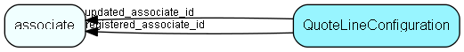

# QuoteLineConfiguration Table (445)

Configuration of quote lines - which fields are in use, rights, labels etc

## Fields

| Name | Description | Type | Null |
|------|-------------|------|:----:|
|quotelineconfiguration\_id|Primary key|PK| |
|FieldName|The name of the field being configured, from data dictionary|String(254)|&#x25CF;|
|LabelRes|The name of the label resource, without square brackets|String(254)|&#x25CF;|
|TooltipRes|The name of the tooltip/description resource, without square brackets|String(254)|&#x25CF;|
|InUse|Is this field in use (visible)|Bool|&#x25CF;|
|Mandatory|Is this field mandatory (must have a value|Bool|&#x25CF;|
|Editable|Is this field editable, as opposed to read-only|Bool|&#x25CF;|
|Rank|Rank order of configuration lines|Int|&#x25CF;|
|PreventHide|If true, then this field cannot be hidden from the GUI|Bool|&#x25CF;|
|RestrictEdit|If true, then this field cannot be set readwrite or mandatory: It&apos;s bound to be readonly|Bool|&#x25CF;|
|registered|Registered when|UtcDateTime| |
|registered\_associate\_id|Registered by whom|FK [associate](associate.md)| |
|updated|Last updated when|UtcDateTime| |
|updated\_associate\_id|Last updated by whom|FK [associate](associate.md)| |
|updatedCount|Number of updates made to this record|UShort| |

[!include[details](./includes/quotelineconfiguration.md)]

## Indexes

| Fields | Types | Description |
|--------|-------|-------------|
|quotelineconfiguration\_id |PK |Clustered, Unique |

## Relationships

| Table|  Description |
|------|-------------|
|[associate](associate.md)  |Employees, resources and other users - except for External persons |

## Replication Flags

* Replicate changes DOWN from central to satellites and travellers.
* Copy to satellite and travel prototypes.

## Security Flags

* No access control via user's Role.

