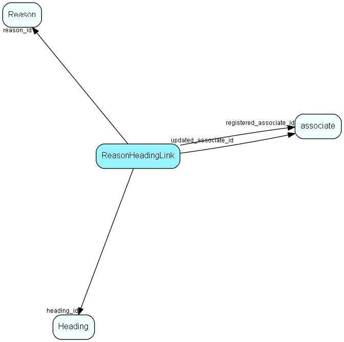

# ReasonHeadingLink Table (105)

Heading link table for Reason, for MDO headers

## Fields

| Name | Description | Type | Null |
|------|-------------|------|:----:|
|reasonheadinglink\_id|Primary key|PK| |
|reason\_id|Link to Reason list table|FK [Reason](reason.md)| |
|heading\_id|Link to Heading table|FK [Heading](heading.md)| |
|registered|Registered when|UtcDateTime| |
|registered\_associate\_id|Registered by whom|FK [associate](associate.md)| |
|updated|Last updated when|UtcDateTime| |
|updated\_associate\_id|Last updated by whom|FK [associate](associate.md)| |
|updatedCount|Number of updates made to this record|UShort| |

[!include[details](./includes/reasonheadinglink.md)]

## Indexes

| Fields | Types | Description |
|--------|-------|-------------|
|reasonheadinglink\_id |PK |Clustered, Unique |
|reason\_id |FK |Index |
|heading\_id |FK |Index |

## Relationships

| Table|  Description |
|------|-------------|
|[associate](associate.md)  |Employees, resources and other users - except for External persons |
|[Heading](heading.md)  |Heading items for all MDO lists, lists that are grouped and filtered. |
|[Reason](reason.md)  |Reason list table. Why we lost the sale (list) |

## Replication Flags

* Replicate changes DOWN from central to satellites and travellers.
* Replicate changes UP from satellites and travellers back to central.
* Copy to satellite and travel prototypes.

## Security Flags

* No access control via user's Role.

